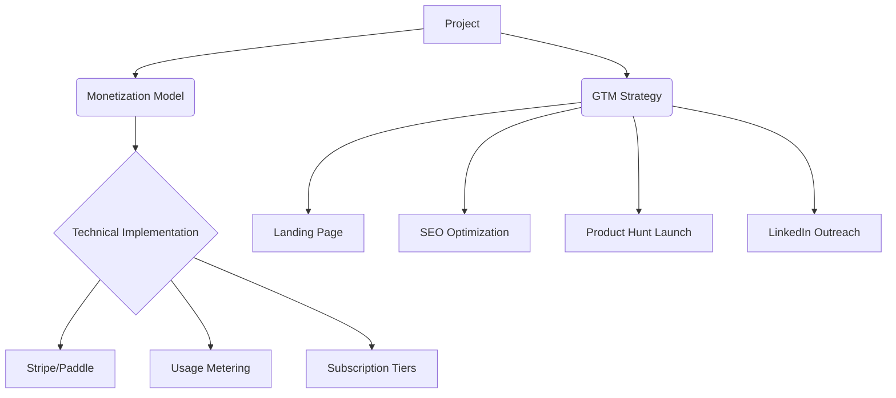

# **Ultimate 9-Month Full-Stack ML Engineer Plan**  
*With Weekly Resources, Projects, and Commercialization Strategies*

## **Month 1: Python & Data Engineering Foundation**  
*(Building PropertyIQ SaaS)*  

### Week 1: Professional Python & Scraping  
- **Core Skills**: Async I/O, decorators, type hints  
- **Resources**:  
  - [Real Python Concurrency](https://realpython.com/python-concurrency/)  
  - [Advanced Scrapy Patterns](https://scrapy.org/)  
  - [Beautiful Soup Documentation](https://beautiful-soup-4.readthedocs.io/)  
- **Project Task**: Build Zillow/Redfin scraper with automated email alerts  
- **Outcome**: `property_scraper.py` with error handling  

### Week 2: Cloud Infrastructure & DevOps  
- **Core Skills**: AWS S3/EC2, Docker, GitHub Actions  
- **Resources**:  
  - [AWS Python SDK Guide](https://boto3.amazonaws.com/v1/documentation/api/latest/index.html)  
  - [Docker for Python Apps](https://docker-curriculum.com/)  
  - [GitHub Actions CI/CD](https://github.com/features/actions)  
- **Project Task**: Containerize scraper, automate daily runs with GitHub Actions  
- **Outcome**: Scheduled pipeline storing data in S3  

### Week 3: PostgreSQL & Data Modeling  
- **Core Skills**: Schema design, window functions, pgvector  
- **Resources**:  
  - [PostgreSQL Exercises](https://pgexercises.com/)  
  - [pgvector for Embeddings](https://supabase.com/docs/guides/database/extensions/pgvector)  
  - [SQLAlchemy ORM](https://docs.sqlalchemy.org/)  
- **Project Task**: Design property database with location embeddings  
- **Outcome**: `propertyiq_db` with vectorized addresses  

### Week 4: ETL Pipelines & Monitoring  
- **Core Skills**: Prefect, data validation, Great Expectations  
- **Resources**:  
  - [Prefect 2.0 Tutorial](https://docs.prefect.io/latest/tutorials/first-steps/)  
  - [Great Expectations Guide](https://docs.greatexpectations.io/)  
- **Project Task**: Build data quality checks for property listings  
- **Outcome**: Pipeline dashboard with data drift alerts  

---

## **Month 2: Classical ML & Deployment**  
*(Monetizing PropertyIQ)*  

### Week 5: Feature Engineering & XGBoost  
- **Core Skills**: Feature stores, hyperparameter tuning  
- **Resources**:  
  - [Feature Engineering Course](https://www.kaggle.com/learn/feature-engineering)  
  - [XGBoost Documentation](https://xgboost.readthedocs.io/)  
- **Project Task**: Build price prediction model  
- **Outcome**: MLflow-tracked model with >90% accuracy  

### Week 6: FastAPI & Backend Development  
- **Core Skills**: REST APIs, JWT auth, SQLModel  
- **Resources**:  
  - [FastAPI Tutorial](https://fastapi.tiangolo.com/tutorial/)  
  - [SQLModel CRUD Guide](https://sqlmodel.tiangolo.com/tutorial/fastapi/simple-hero-api/)  
- **Project Task**: Create prediction endpoint with rate limiting  
- **Outcome**: `POST /predict` endpoint with auth  

### Week 7: Streamlit & Data Visualization  
- **Core Skills**: Plotly, caching, session state  
- **Resources**:  
  - [Streamlit Components](https://docs.streamlit.io/library/components)  
  - [Plotly Express Guide](https://plotly.com/python/plotly-express/)  
- **Project Task**: Build investor dashboard with heatmaps  
- **Outcome**: `propertyiq-dashboard.streamlit.app`  

### Week 8: Monetization & Deployment  
- **Core Skills**: Stripe integration, Vercel deployment  
- **Resources**:  
  - [Stripe Python API](https://stripe.com/docs/api)  
  - [Vercel Deployment Guide](https://vercel.com/docs)  
- **Project Task**: Add subscription tiers to dashboard  
- **Outcome**: Live SaaS at `propertyiq.com`  

---

## **Month 3: Deep Learning Fundamentals**  
*(Building RetailEye)*  

### Week 9: PyTorch & Computer Vision  
- **Core Skills**: Tensors, autograd, CNNs  
- **Resources**:  
  - [PyTorch Zero to Mastery](https://www.learnpytorch.io/)  
  - [Roboflow Dataset Tools](https://roboflow.com)  
- **Project Task**: Label shelf images with bounding boxes  
- **Outcome**: Custom dataset with 500+ annotated images  

### Week 10: Transfer Learning & MobileNet  
- **Core Skills**: Fine-tuning, quantization  
- **Resources**:  
  - [Torchvision Models](https://pytorch.org/vision/stable/models.html)  
  - [ONNX Conversion Guide](https://onnxruntime.ai/docs/)  
- **Project Task**: Train MobileNetV2 for product detection  
- **Outcome**: Quantized model (<10MB) with 95% mAP  

### Week 11: Real-time Inference  
- **Core Skills**: WebSockets, video streaming  
- **Resources**:  
  - [FastAPI WebSockets](https://fastapi.tiangolo.com/advanced/websockets/)  
  - [OpenCV Video Processing](https://learnopencv.com/)  
- **Project Task**: Build phone camera processing pipeline  
- **Outcome**: Real-time shelf analysis demo  

### Week 12: Edge Deployment  
- **Core Skills**: ONNX Runtime, AWS Lambda GPU  
- **Resources**:  
  - [ONNX Runtime Python](https://onnxruntime.ai/docs/get-started/)  
  - [Serverless GPU Guide](https://aws.amazon.com/blogs/compute/announcing-gpu-support-for-aws-lambda-functions/)  
- **Project Task**: Deploy model to serverless endpoint  
- **Outcome**: `retaileye-api.com` with pay-per-inference  

---

## **Month 4: NLP & LLM Engineering**  
*(Building LegalBot)*  

### Week 13: Transformer Architectures  
- **Core Skills**: Attention, tokenization, embeddings  
- **Resources**:  
  - [Hugging Face NLP Course](https://huggingface.co/learn/nlp-course)  
  - [The Illustrated Transformer](https://jalammar.github.io/illustrated-transformer/)  
- **Project Task**: Build legal document chunking pipeline  
- **Outcome**: PDF-to-text processor with metadata  

### Week 14: RAG Implementation  
- **Core Skills**: Vector databases, query expansion  
- **Resources**:  
  - [LangChain RAG Guide](https://python.langchain.com/docs/use_cases/question_answering/)  
  - [pgvector vs Pinecone](https://supabase.com/docs/guides/database/extensions/pgvector)  
- **Project Task**: Create legal Q&A system with citations  
- **Outcome**: Contract analysis MVP  

### Week 15: LLM Fine-Tuning  
- **Core Skills**: LoRA, QLoRA, PEFT  
- **Resources**:  
  - [Mistral Fine-Tuning](https://huggingface.co/docs/transformers/main/en/model_doc/mistral)  
  - [Unsloth Optimization](https://github.com/unslothai/unsloth)  
- **Project Task**: Fine-tune Mistral-7B on SEC filings  
- **Outcome**: Specialized legal LLM  

### Week 16: Multi-Modal Systems  
- **Core Skills**: Document layout analysis  
- **Resources**:  
  - [LayoutLM Documentation](https://huggingface.co/docs/transformers/model_doc/layoutlm)  
  - [Donut Transformer](https://github.com/clovaai/donut)  
- **Project Task**: Add table extraction to LegalBot  
- **Outcome**: Complex contract understanding  

---

## **Month 5: MLOps & Scaling**  
*(Productionizing Systems)*  

### Week 17: Kubernetes for ML  
- **Core Skills**: Helm charts, Kubeflow  
- **Resources**:  
  - [Kubernetes the Hard Way](https://github.com/kelseyhightower/kubernetes-the-hard-way)  
  - [Kubeflow Pipelines](https://www.kubeflow.org/docs/components/pipelines/)  
- **Project Task**: Deploy LegalBot on EKS cluster  
- **Outcome**: Auto-scaling inference service  

### Week 18: Monitoring & Observability  
- **Core Skills**: Prometheus, Grafana, Evidently  
- **Resources**:  
  - [Prometheus Python Client](https://github.com/prometheus/client_python)  
  - [Evidently Reports](https://docs.evidentlyai.com/)  
- **Project Task**: Implement drift detection for RetailEye  
- **Outcome**: Automated retraining pipeline  

### Week 19: Serverless AI  
- **Core Skills**: AWS Lambda GPU, Cloudflare Workers  
- **Resources**:  
  - [Lambda GPU Guide](https://aws.amazon.com/blogs/compute/announcing-gpu-support-for-aws-lambda-functions/)  
  - [Cloudflare AI Docs](https://developers.cloudflare.com/workers-ai/)  
- **Project Task**: Build edge version of RetailEye  
- **Outcome**: Offline-capable mobile app  

### Week 20: CI/CD Automation  
- **Core Skills**: GitOps, Argo CD  
- **Resources**:  
  - [Argo CD Tutorial](https://argo-cd.readthedocs.io/en/stable/)  
  - [MLOps Zoomcamp](https://github.com/DataTalksClub/mlops-zoomcamp)  
- **Project Task**: Create GitOps pipeline for all projects  
- **Outcome**: Zero-downtime deployments  

---

## **Month 6: Generative AI Systems**  
*(Building ContentForge)*  

### Week 21: Multi-Modal Generation  
- **Core Skills**: Diffusion models, TTS, video synthesis  
- **Resources**:  
  - [Stable Diffusion API](https://stability.ai/)  
  - [ElevenLabs TTS](https://elevenlabs.io/)  
- **Project Task**: Build blog-to-video pipeline  
- **Outcome**: 1-minute video from text prompt  

### Week 22: LLM Orchestration  
- **Core Skills**: Agent frameworks, function calling  
- **Resources**:  
  - [LangChain Agents](https://python.langchain.com/docs/modules/agents/)  
  - [LlamaIndex RAG](https://www.llamaindex.ai/)  
- **Project Task**: Create content calendar generator  
- **Outcome**: Automated content planning system  

### Week 23: Brand Consistency  
- **Core Skills**: Fine-tuning, style transfer  
- **Resources**:  
  - [LoRA Training Guide](https://huggingface.co/docs/peft)  
  - [StyleGAN Adaptation](https://github.com/NVlabs/stylegan3)  
- **Project Task**: Train brand-specific style model  
- **Outcome**: On-brand visual generation  

### Week 24: Workflow Automation  
- **Core Skills**: Zapier, Make.com, webhooks  
- **Resources**:  
  - [Zapier API Docs](https://zapier.com/apps/help)  
  - [Pipedream Workflows](https://pipedream.com/)  
- **Project Task**: Connect ContentForge to social APIs  
- **Outcome**: Auto-posting to 5+ platforms  

---

## **Month 7: AI Agents & Systems**  
*(Building AutoGrowth)*  

### Week 25: Agent Architectures  
- **Core Skills**: CrewAI, hierarchical planning  
- **Resources**:  
  - [CrewAI Documentation](https://docs.crewai.com/)  
  - [LangGraph Guide](https://python.langchain.com/docs/langgraph)  
- **Project Task**: Design marketing agent roles  
- **Outcome**: Researcher-Writer-Strategist team  

### Week 26: Tool Integration  
- **Core Skills**: API toolkits, SERP scraping  
- **Resources**:  
  - [SerpAPI Python Client](https://serpapi.com/)  
  - [Google Trends API](https://pypi.org/project/pytrends/)  
- **Project Task**: Connect agents to market data  
- **Outcome**: Real-time competitive analysis  

### Week 27: Performance Optimization  
- **Core Skills**: LLM caching, token reduction  
- **Resources**:  
  - [GPTCache Tutorial](https://gptcache.readthedocs.io/)  
  - [LLM Prompt Compression](https://github.com/jianfch/llmlingua)  
- **Project Task**: Reduce agent operation costs by 50%  
- **Outcome**: Efficient agent system  

### Week 28: Memory & Learning  
- **Core Skills**: Vector memory, reflection  
- **Resources**:  
  - [MemGPT Architecture](https://memgpt.ai/)  
  - [Agent Memory Patterns](https://arxiv.org/abs/2310.07851)  
- **Project Task**: Implement campaign performance memory  
- **Outcome**: Self-improving marketing strategy  

---

## **Month 8: Full-Stack Integration**  

### Week 29: Next.js Frontends  
- **Core Skills**: App router, server components  
- **Resources**:  
  - [Next.js Tutorial](https://nextjs.org/learn)  
  - [shadcn/ui Components](https://ui.shadcn.com/)  
- **Project Task**: Build unified dashboard for all products  
- **Outcome**: `app.mymlcompany.com`  

### Week 30: Auth & Security  
- **Core Skills**: NextAuth, RBAC, encryption  
- **Resources**:  
  - [NextAuth.js Guide](https://next-auth.js.org/)  
  - [OWASP Cheat Sheets](https://cheatsheetseries.owasp.org/)  
- **Project Task**: Implement SSO for all products  
- **Outcome**: Secure role-based access  

### Week 31: Real-time Systems  
- **Core Skills**: WebSockets, Server-Sent Events  
- **Resources**:  
  - [Socket.IO Tutorial](https://socket.io/docs/v4/)  
  - [Ably Pub/Sub](https://ably.com/docs)  
- **Project Task**: Add live analytics to AutoGrowth  
- **Outcome**: Real-time campaign dashboard  

### Week 32: Payment Systems  
- **Core Skills**: Stripe subscriptions, usage billing  
- **Resources**:  
  - [Stripe Metered Billing](https://stripe.com/docs/billing/subscriptions/metered-billing)  
  - [Paddle Tax Handling](https://developer.paddle.com/)  
- **Project Task**: Implement pay-per-use for LegalBot  
- **Outcome**: Flexible monetization  

---

## **Month 9: Launch & Commercialization**  

### Week 33: Landing Pages & SEO  
- **Core Skills**: Conversion optimization, technical SEO  
- **Resources**:  
  - [Vercel OG Image Generation](https://vercel.com/docs/functions/og-image-generation)  
  - [Ahrefs SEO Course](https://ahrefs.com/academy/)  
- **Project Task**: Create high-conversion landing pages  
- **Outcome**: 5 product websites  

### Week 34: User Onboarding  
- **Core Skills**: Walkthroughs, tooltips, education  
- **Resources**:  
  - [Userpilot Guides](https://userpilot.com/)  
  - [Chameleon Tours](https://www.chameleon.io/)  
- **Project Task**: Build interactive product tours  
- **Outcome**: Self-serve onboarding  

### Week 35: Analytics & Optimization  
- **Core Skills**: A/B testing, funnel analysis  
- **Resources**:  
  - [PostHog Tutorial](https://posthog.com/docs)  
  - [GrowthBook Experiments](https://docs.growthbook.io/)  
- **Project Task**: Implement conversion tracking  
- **Outcome**: Data-driven optimization  

### Week 36: Launch Strategy  
- **Core Skills**: Product Hunt, cold outreach  
- **Resources**:  
  - [Product Hunt Launch Kit](https://www.producthunt.com/launch)  
  - [Cold Email Mastery](https://github.com/eliostvs/gpt-cold-emails)  
- **Project Task**: Execute coordinated product launch  
- **Outcome**: First 100 paying customers  

---

## **Commercialization Framework**  


## **Resource Cheat Sheet**  
**Always-Free Learning**:  
- [freeCodeCamp ML](https://freecodecamp.org/learn/machine-learning)  
- [Google ML Crash Course](https://developers.google.com/machine-learning/crash-course)  
- [Kaggle Micro-Courses](https://kaggle.com/learn)  

**Essential Repositories**:  
1. [Full-Stack FastAPI Template](https://github.com/tiangolo/full-stack-fastapi-postgresql)  
2. [Next.js AI SaaS Boilerplate](https://github.com/mckaywrigley/ai-saas-template)  
3. [Production MLOps Pipeline](https://github.com/visenger/awesome-mlops)  

**Community Support**:  
- [MLOps.community Discord](https://mlops.community/)  
- [Hugging Face Forums](https://discuss.huggingface.co/)  
- [r/MachineLearning](https://reddit.com/r/MachineLearning)  

**Tools You Need**:  
```markdown
| Category       | Essentials                                  |
|----------------|--------------------------------------------|
| IDE            | VS Code + GitHub Copilot                   |
| ML Development | PyTorch + Weights & Biases                 |
| Deployment     | Docker + Kubernetes + Terraform            |
| Monitoring     | Prometheus + Grafana + Evidently           |
| Agents         | CrewAI + LangGraph                         |
| Frontend       | Next.js + shadcn/ui + Vercel               |
```

**Next Steps**:  
1. Create GitHub organization for your projects  
2. Set up AWS/GCP with $300 free credits  
3. Join 1 ML community and introduce yourself  
4. Start Week 1 project (scraper + email alerts)  

> "The best learning is building something people will pay for."  
> This plan delivers **5 revenue-ready products** in 9 months while teaching production-grade skills.
