### Comprehensive Plan for Building "HealthNugget" - AI-Powered Health & Nutrition Platform

#### **Phase 1: Core Architecture & Tech Stack**
1. **Backend Framework**:
   - Node.js (Express) for API/web server
   - Python (Flask/FastAPI) for ML services
   - Communication: REST APIs + RabbitMQ for async tasks

2. **Database**:
   - PostgreSQL (Primary DB) + Redis (caching/sessions)
   - Schema Design Highlights:
     ```sql
     -- Example Core Tables --
     CREATE TABLE users (
         user_id UUID PRIMARY KEY,
         email VARCHAR(255) UNIQUE,
         password_hash TEXT,
         age INT,
         gender VARCHAR(20),
         height_cm FLOAT,
         weight_kg FLOAT,
         activity_level VARCHAR(50)
     );

     CREATE TABLE food_items (
         food_id SERIAL PRIMARY KEY,
         name VARCHAR(255) UNIQUE,
         calories FLOAT,
         protein FLOAT,
         carbs FLOAT,
         fats FLOAT,
         vitamins JSONB  -- Stores {"vitamin_a": 0.5, "vitamin_c": 20, ...}
     );

     CREATE TABLE user_logs (
         log_id BIGSERIAL PRIMARY KEY,
         user_id UUID REFERENCES users(user_id),
         log_date TIMESTAMP DEFAULT NOW(),
         food_items JSONB,  -- {food_id: qty}
         exercise_minutes INT,
         water_ml INT,
         weight FLOAT
     );

     CREATE TABLE exercises (
         exercise_id SERIAL PRIMARY KEY,
         name VARCHAR(255),
         category VARCHAR(50),  -- yoga/gym/cardio
         calories_per_min FLOAT,
         benefits TEXT[]  -- Array of benefits
     );

     CREATE TABLE health_insights (
         insight_id SERIAL PRIMARY KEY,
         symptom VARCHAR(255),  -- e.g. "blurred vision"
         potential_causes TEXT[],  -- ["vitamin_a deficiency", ...]
         recommended_actions TEXT[]
     );

     CREATE TABLE cms_content (
         content_id UUID PRIMARY KEY,
         author_id UUID REFERENCES users(user_id)),
         title VARCHAR(255),
         body TEXT,
         content_type VARCHAR(50),  -- blog/medicinal-info/user-article
         created_at TIMESTAMP DEFAULT NOW()
     );
     ```

3. **Infrastructure**:
   - Cloud: AWS/GCP (Free Tier to start)
   - Containerization: Docker + Kubernetes (EKS/GKE)
   - CI/CD: GitHub Actions + ArgoCD
   - Monitoring: Prometheus + Grafana (free)

#### **Phase 2: Core Features Implementation**
1. **Nutrition Module**:
   - Food Database: Integrate with USDA FoodData Central API (free)
   - Image Recognition: Use TensorFlow.js for food detection
   - Calorie Tracker: 
     ```python
     # Python ML Service
     def calculate_daily_needs(user_data):
         # Harris-Benedict Equation with ML adjustments
         bmr = 10*user_data['weight'] + 6.25*user_data['height'] - 5*user_data['age']
         bmr += 5 if user_data['gender'] == 'male' else -161
         return bmr * activity_factors[user_data['activity_level'] * health_factors
     ```

2. **Exercise Engine**:
   - Exercise Recommendation Algorithm:
     ```javascript
     // Node.js Recommendation Logic
     function recommendExercises(user, goals) {
       const baseExercises = await db.query(`
         SELECT * FROM exercises 
         WHERE difficulty <= $1 
         AND equipment IN ($2)
       `, [user.fitness_level, user.equipment]);
       
       // AI Personalization (Python service via RabbitMQ)
       return personalizeExercises(baseExercises, user.health_data);
     }
     ```

3. **Health Insights AI**:
   - Symptom Analysis Engine:
     ```python
     # Scikit-Learn/NLP based analyzer
     def analyze_symptoms(symptoms_text):
         vectorized = tfidf_vectorizer.transform([symptoms_text])
         deficiencies = deficiency_clf.predict(vectorized)
         return db.query("""
             SELECT * FROM health_insights 
             WHERE symptom IN %(deficiencies)s
         """, {'deficiencies': tuple(deficiencies)})
     ```

4. **Hydration Calculator**:
   - Dynamic Water Recommendation:
     ```javascript
     // Node.js
     function calculateWater(user) {
         const base = user.weight * 0.033; // liters
         let adjustment = 0;
         if (user.activity_level === 'high') adjustment += 0.5;
         if (user.health_data?.pregnant) adjustment += 0.3;
         return (base + adjustment) * 1000; // in ml
     }
     ```

#### **Phase 3: CMS & Content Ecosystem**
1. **Headless CMS Architecture**:
   - Next.js for SSG (Static Site Generation)
   - Editor: Quill.js (open-source rich text editor)
   - Moderation Flow:
     ```mermaid
     graph LR
     User[User Submits] --> ModQueue[Moderation Queue]
     ModQueue -- Approved --> Published
     ModQueue -- Rejected --> Notify[User Notification]
     ```

2. **Knowledge Base Structure**:
   - Articles tagged with:
     - Nutrition Facts
     - Exercise Science
     - Disease Prevention
     - Supplement Guides
   - SEO-optimized with automatic schema.org markup

#### **Phase 4: Security & Compliance**
1. **Critical Measures**:
   - Auth: JWT + OAuth 2.0 (Passport.js)
   - Data: AES-256 encryption at rest
   - Compliance: HIPAA-ready architecture (separate health data storage)
   - Pentesting: OWASP ZAP + SQLMap scans

2. **Security Architecture**:
   ```
   Client → Cloudflare (WAF) → API Gateway → 
   Microservice (Auth Check) → 
   [Services: User | Nutrition | CMS | ML]
   ```

#### **Phase 5: Scalability to 1M Users**
1. **Database Scaling**:
   - PostgreSQL: Read replicas + Connection pooling (PgBouncer)
   - Partitioning: 
     ```sql
     CREATE TABLE user_logs_2023 PARTITION OF user_logs
     FOR VALUES FROM ('2023-01-01') TO ('2024-01-01');
     ```

2. **Caching Strategy**:
   - Redis: 
     - Query caching (30s TTL)
     - Session storage
   - CDN: Cloudflare for static assets

3. **ML Model Serving**:
   - TensorFlow Serving with Kubernetes HPA
   - Async processing for heavy computations

#### **Phase 6: Development Roadmap**
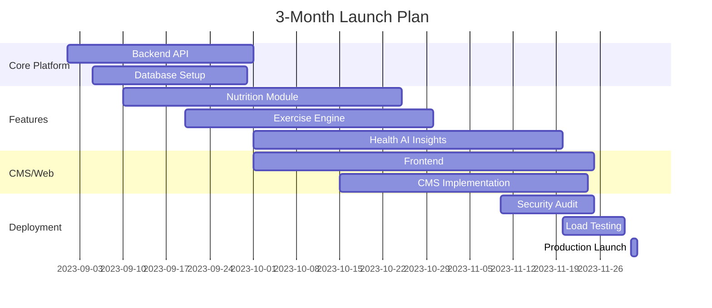

#### **Phase 7: Monetization & Marketing Prep**
1. **Revenue Streams**:
   - Premium analytics (Athlete Mode)
   - Partner supplement marketplace
   - Health coach subscription tiers

2. **GTM Strategy**:
   - SEO: "Nutrition calculator", "Fitness tracker" keywords
   - Content Marketing: Partner with fitness influencers
   - Athlete Outreach: NCAA teams/local gym partnerships

#### **Immediate Next Steps**
1. **Set up repo structure**:
   ```
   /healthnugget
     ├── /backend-node
     ├── /ml-python
     ├── /frontend-next
     ├── /infra
     └── docker-compose.yml
   ```

2. **Initial DB migration**:
   ```bash
   npm install -g db-migrate
   db-migrate create init-tables --sql-file
   ```

3. **Core API skeleton**:
   ```javascript
   // Express.js
   app.post('/api/log-food', authMiddleware, async (req, res) => {
     const log = await FoodService.logEntry(
       req.user.id, 
       req.body.foodItems
     );
     res.json({ log, calories: log.totalCalories });
   });
   ```

#### **Key Open-Source Tools**
- ML: Scikit-learn, TensorFlow.js, spaCy
- Analytics: Apache Superset
- Search: Typesense (OSS alternative to Algolia)
- Notifications: Novu (OSS SendGrid alternative)

Let's proceed with detailed implementation for each module! Which component would you like to dive into first?
- Nutrition Database Schema Deep Dive
- Exercise Recommendation Engine
- JWT Authentication Flow
- CMS Content Modeling
- Deployment Pipeline Setup

### Comprehensive Implementation Plan with Diagrams

#### 1. System Architecture Diagram
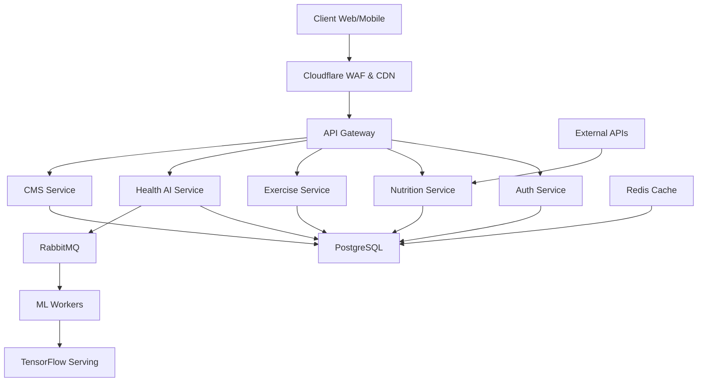

#### 2. Database Schema Implementation
```sql
-- USERS MODULE
CREATE TABLE users (
    user_id UUID PRIMARY KEY DEFAULT gen_random_uuid(),
    email VARCHAR(255) UNIQUE NOT NULL,
    password_hash TEXT NOT NULL,
    age SMALLINT CHECK (age >= 13),
    gender VARCHAR(20),
    height_cm NUMERIC(5,2),
    weight_kg NUMERIC(5,2),
    activity_level VARCHAR(50),
    created_at TIMESTAMPTZ DEFAULT NOW(),
    health_conditions TEXT[]
);

-- NUTRITION MODULE
CREATE TABLE food_items (
    food_id SERIAL PRIMARY KEY,
    name VARCHAR(255) NOT NULL,
    description TEXT,
    serving_size_g NUMERIC(6,2),
    calories NUMERIC(6,2),
    protein_g NUMERIC(6,2),
    carbs_g NUMERIC(6,2),
    fats_g NUMERIC(6,2),
    vitamins JSONB,
    created_at TIMESTAMPTZ DEFAULT NOW()
);

CREATE TABLE user_food_log (
    log_id BIGSERIAL PRIMARY KEY,
    user_id UUID REFERENCES users(user_id),
    food_id INTEGER REFERENCES food_items(food_id),
    quantity NUMERIC(6,2),
    consumed_at TIMESTAMPTZ DEFAULT NOW(),
    meal_type VARCHAR(20),
    image_url TEXT
);

-- EXERCISE MODULE
CREATE TABLE exercises (
    exercise_id SERIAL PRIMARY KEY,
    name VARCHAR(255) NOT NULL,
    description TEXT,
    category VARCHAR(50),  -- yoga/gym/cardio
    difficulty VARCHAR(20),
    equipment TEXT[],
    calories_per_min NUMERIC(5,2),
    muscle_groups TEXT[],
    video_url TEXT
);

CREATE TABLE user_exercise_log (
    session_id BIGSERIAL PRIMARY KEY,
    user_id UUID REFERENCES users(user_id),
    exercise_id INTEGER REFERENCES exercises(exercise_id),
    duration_min INTEGER,
    calories_burned NUMERIC(7,2),
    performed_at TIMESTAMPTZ DEFAULT NOW()
);

-- HEALTH AI MODULE
CREATE TABLE health_insights (
    insight_id SERIAL PRIMARY KEY,
    symptom VARCHAR(255) NOT NULL,
    potential_causes TEXT[] NOT NULL,
    recommended_actions TEXT[] NOT NULL,
    severity VARCHAR(20),
    created_at TIMESTAMPTZ DEFAULT NOW()
);

CREATE TABLE user_health_log (
    health_log_id BIGSERIAL PRIMARY KEY,
    user_id UUID REFERENCES users(user_id),
    water_ml INTEGER,
    weight_kg NUMERIC(5,2),
    symptoms TEXT[],
    created_at TIMESTAMPTZ DEFAULT NOW()
);

-- CMS MODULE
CREATE TABLE cms_content (
    content_id UUID PRIMARY KEY DEFAULT gen_random_uuid(),
    author_id UUID REFERENCES users(user_id),
    title VARCHAR(255) NOT NULL,
    slug VARCHAR(255) UNIQUE NOT NULL,
    body TEXT NOT NULL,
    content_type VARCHAR(50) NOT NULL,  -- article/blog/medicinal
    status VARCHAR(20) DEFAULT 'draft',
    created_at TIMESTAMPTZ DEFAULT NOW(),
    updated_at TIMESTAMPTZ
);

CREATE TABLE content_categories (
    category_id SERIAL PRIMARY KEY,
    name VARCHAR(100) NOT NULL,
    slug VARCHAR(100) UNIQUE NOT NULL
);

CREATE TABLE content_category_map (
    content_id UUID REFERENCES cms_content(content_id),
    category_id INTEGER REFERENCES content_categories(category_id),
    PRIMARY KEY (content_id, category_id)
);
```

#### 3. Authentication Flow Sequence Diagram
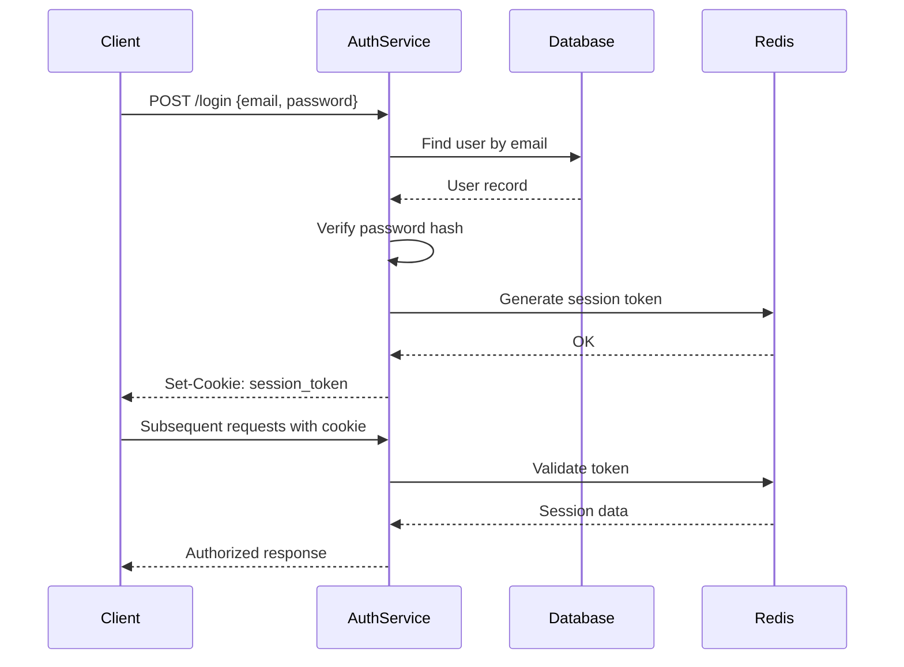

#### 4. Nutrition Analysis Workflow
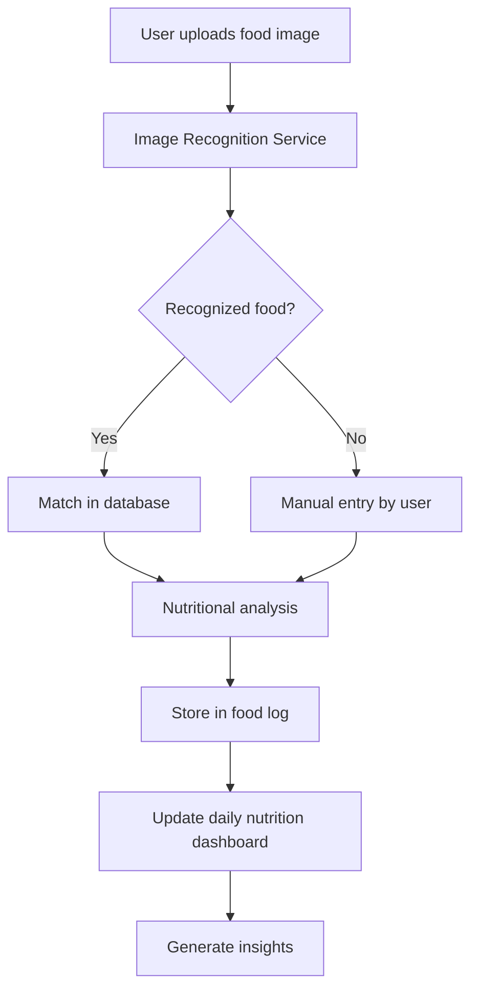

#### 5. Water Intake Calculation Algorithm
```python
def calculate_water_intake(user):
    base = user.weight_kg * 0.033  # Base: 33ml per kg
    adjustments = 0
    
    if user.activity_level == 'high':
        adjustments += 0.5  # +500ml
    elif user.activity_level == 'moderate':
        adjustments += 0.3  # +300ml
        
    if user.health_conditions and 'pregnant' in user.health_conditions:
        adjustments += 0.3  # +300ml
        
    if user.environment == 'hot':
        adjustments += 0.4  # +400ml
        
    total_liters = base + adjustments
    return round(total_liters * 1000)  # Convert to ml
```

#### 6. Exercise Recommendation Engine
```python
def recommend_exercises(user, goals):
    # 1. Filter by user equipment
    base_query = Exercise.objects.filter(
        difficulty_lte=user.fitness_level,
        equipment__overlap=user.available_equipment
    )
    
    # 2. Personalization based on goals
    if 'weight_loss' in goals:
        base_query = base_query.filter(calories_per_min__gte=8)
    elif 'muscle_gain' in goals:
        base_query = base_query.filter(
            primary_muscles__overlap=user.target_muscles
        )
    
    # 3. Time-based filtering
    if user.available_time < 30:
        base_query = base_query.filter(duration_min__lte=30)
    
    # 4. ML-based personalization
    ml_recommendations = get_ml_recommendations(user.id)
    return base_query.annotate(
        ml_score=Case(
            When(id__in=ml_recommendations, then=Value(1)),
            default=Value(0),
            output_field=IntegerField()
        )
    ).order_by('-ml_score', '?')[:5]
```

#### 7. Health Insights Generation
```python
def generate_health_insights(user):
    symptoms = get_user_symptoms(user.id)
    insights = []
    
    # Analyze nutritional deficiencies
    nutrient_deficiencies = detect_deficiencies(user.nutrition_data)
    for nutrient, severity in nutrient_deficiencies.items():
        insight = HealthInsight.objects.filter(
            potential_causes__contains=[f"{nutrient} deficiency"]
        ).first()
        if insight:
            insights.append({
                "type": "nutrition",
                "severity": severity,
                "message": insight.recommended_actions[0]
            })
    
    # Analyze exercise patterns
    if user.exercise_data.last_week_avg < 150:
        insights.append({
            "type": "activity",
            "severity": "medium",
            "message": "Low activity detected. Aim for 150+ mins weekly"
        })
    
    # Hydration analysis
    if user.water_intake < calculate_water_intake(user) * 0.7:
        insights.append({
            "type": "hydration",
            "severity": "low",
            "message": "Increase water intake for better metabolism"
        })
    
    return insights
```

#### 8. CMS Workflow Diagram
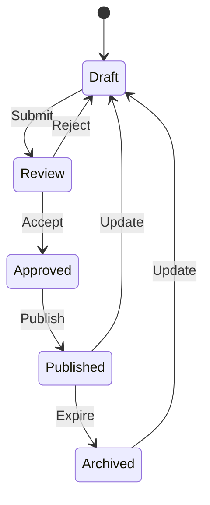

#### 9. Security Implementation Matrix
| Layer          | Security Measures                          | Tools                          |
|----------------|-------------------------------------------|--------------------------------|
| Network        | WAF, DDoS protection                      | Cloudflare                     |
| Application    | Input validation, Rate limiting           | Express-validator, rate-limiter|
| Authentication | JWT, OAuth2, Password policies            | Passport.js, bcrypt            |
| Database       | Encryption at rest, Row-level security    | PostgreSQL RLS, pgcrypto       |
| API            | HTTPS, CORS, Signed requests              | Let's Encrypt, helmet          |
| Monitoring     | Intrusion detection, Log analysis         | OSSEC, ELK Stack               |

#### 10. Scaling Strategy for 1M Users
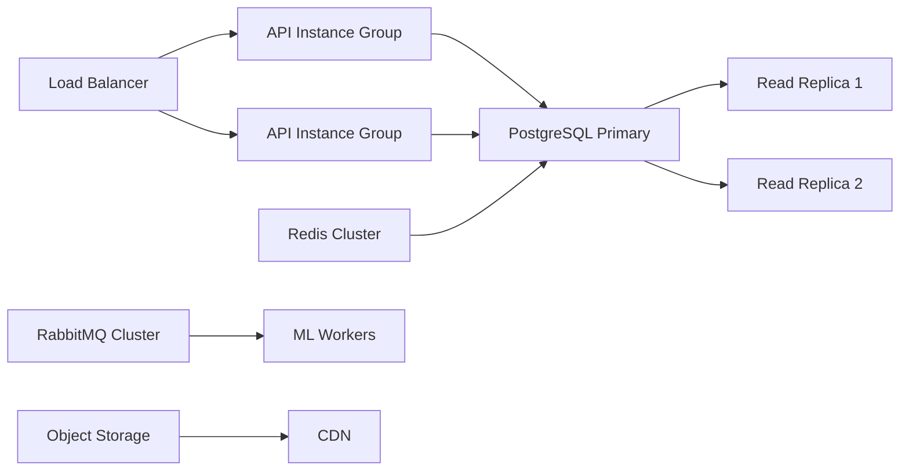

#### Implementation Roadmap

1. **Week 1-2: Core Infrastructure Setup**
   - Configure PostgreSQL with RLS
   - Set up Node.js/Express backend skeleton
   - Implement JWT authentication
   - Configure Redis for session caching
   - Setup Docker containers for all services

2. **Week 3-4: Nutrition Module**
   - Food database schema implementation
   - USDA API integration
   - Image recognition with TensorFlow.js
   - Food logging endpoints
   - Daily nutrition dashboard

3. **Week 5-6: Exercise & Health Modules**
   - Exercise database population
   - Recommendation algorithm
   - Workout logging
   - Water intake calculator
   - Symptom analysis engine

4. **Week 7-8: CMS & Content Ecosystem**
   - Headless CMS implementation
   - Rich text editor integration
   - Content moderation workflow
   - User-generated content system
   - SEO optimization

5. **Week 9: Security & Testing**
   - Penetration testing
   - Load testing with Locust
   - HIPAA compliance checks
   - Vulnerability scanning

6. **Week 10-12: Deployment & Optimization**
   - CI/CD pipeline setup
   - Cloud infrastructure deployment
   - Performance tuning
   - Monitoring and alerting
   - Beta launch

#### Critical Next Steps:

1. **Initialize Project Repository:**
```bash
mkdir healthnugget
cd healthnugget
git init
npx license mit > LICENSE
npx gitignore node
mkdir -p backend/{src/migrations,config} ml-services cms frontend
```

2. **Database Setup Script:**
```bash
# Install PostgreSQL
sudo apt install postgresql postgresql-contrib

# Create DB user
sudo -u postgres createuser healthnugget_user
sudo -u postgres psql -c "ALTER USER healthnugget_user PASSWORD 'secure_password';"

# Create database
sudo -u postgres createdb healthnugget_db

# Enable extensions
psql -U healthnugget_user -d healthnugget_db -c "CREATE EXTENSION IF NOT EXISTS pgcrypto;"
```

3. **Initial Migration File:**
```sql
-- backend/src/migrations/001_initial_schema.sql
BEGIN;

CREATE TABLE users (
    -- User table definition
);

CREATE TABLE food_items (
    -- Food items definition
);

-- Additional table definitions

COMMIT;
```

4. **Core API Skeleton:**
```javascript
// backend/src/app.js
const express = require('express');
const authRoutes = require('./routes/auth');
const nutritionRoutes = require('./routes/nutrition');
const helmet = require('helmet');
const rateLimit = require('express-rate-limit');

const app = express();

// Security middleware
app.use(helmet());
app.use(rateLimit({
  windowMs: 15 * 60 * 1000,
  max: 100
}));

// Routes
app.use('/api/auth', authRoutes);
app.use('/api/nutrition', nutritionRoutes);

// Error handler
app.use((err, req, res, next) => {
  console.error(err.stack);
  res.status(500).json({ error: 'Internal Server Error' });
});

module.exports = app;
```

Let's continue with specific module implementation. Which component should we dive into next?
1. Food Image Recognition System
2. Exercise Recommendation Engine
3. Health Insights AI
4. CMS Content Workflow
5. Deployment Pipeline Setup


### Deep Dive: Exercise Recommendation Engine

Let's build a comprehensive, AI-driven exercise recommendation system that personalizes workouts based on user profiles, goals, equipment, and real-time health data. This will be a core feature for our health application.

#### 1. System Architecture
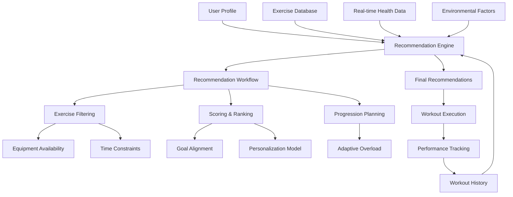

#### 2. Core Database Schema
```sql
-- Extended Exercise Schema
CREATE TABLE exercises (
    exercise_id SERIAL PRIMARY KEY,
    name VARCHAR(255) NOT NULL,
    description TEXT,
    category VARCHAR(50) NOT NULL,  -- yoga, strength, cardio, etc.
    difficulty VARCHAR(20) NOT NULL CHECK (difficulty IN ('beginner', 'intermediate', 'advanced')),
    equipment TEXT[] NOT NULL DEFAULT '{}',  -- e.g., {dumbbells, resistance_bands}
    primary_muscles TEXT[] NOT NULL,  -- e.g., {chest, triceps}
    secondary_muscles TEXT[],
    calories_per_min NUMERIC(5,2) NOT NULL,
    video_url TEXT,
    created_at TIMESTAMPTZ DEFAULT NOW(),
    updated_at TIMESTAMPTZ
);

-- Exercise variations for progression
CREATE TABLE exercise_variations (
    variation_id SERIAL PRIMARY KEY,
    exercise_id INTEGER NOT NULL REFERENCES exercises(exercise_id),
    name VARCHAR(255) NOT NULL,
    difficulty VARCHAR(20) NOT NULL,
    progression_order INTEGER NOT NULL DEFAULT 1
);

-- User Exercise Preferences
CREATE TABLE user_exercise_prefs (
    user_id UUID REFERENCES users(user_id) PRIMARY KEY,
    fitness_level VARCHAR(20) DEFAULT 'beginner',
    fitness_goals TEXT[] DEFAULT '{}',  -- {weight_loss, muscle_gain, endurance}
    available_equipment TEXT[] DEFAULT '{}',
    workout_duration_min INTEGER DEFAULT 30,
    target_muscles TEXT[] DEFAULT '{}',
    health_restrictions TEXT[] DEFAULT '{}'
);

-- Workout History
CREATE TABLE workout_history (
    session_id UUID PRIMARY KEY DEFAULT gen_random_uuid(),
    user_id UUID NOT NULL REFERENCES users(user_id),
    start_time TIMESTAMPTZ NOT NULL,
    end_time TIMESTAMPTZ,
    perceived_difficulty SMALLINT CHECK (perceived_difficulty BETWEEN 1 AND 10),
    notes TEXT,
    heart_rate_avg SMALLINT,
    calories_burned NUMERIC(7,2)
);

-- Session Exercises
CREATE TABLE session_exercises (
    session_id UUID REFERENCES workout_history(session_id),
    exercise_id INTEGER REFERENCES exercises(exercise_id),
    variation_id INTEGER REFERENCES exercise_variations(variation_id),
    sets SMALLINT,
    reps SMALLINT,
    weight_kg NUMERIC(5,2),
    duration_min INTEGER,
    order_index SMALLINT,
    PRIMARY KEY (session_id, exercise_id, variation_id)
);
```

#### 3. Recommendation Algorithm Workflow
```python
def generate_recommendations(user_id: UUID, context: dict) -> list:
    """Generate personalized exercise recommendations"""
    # 1. Fetch user profile and preferences
    user = get_user_profile(user_id)
    prefs = get_exercise_prefs(user_id)
    history = get_recent_workouts(user_id, limit=5)
    
    # 2. Apply filters based on constraints
    base_exercises = filter_exercises(
        difficulty_max=prefs.fitness_level,
        equipment=prefs.available_equipment,
        duration_max=prefs.workout_duration_min,
        avoid_muscles=prefs.health_restrictions
    )
    
    # 3. Score each exercise
    scored_exercises = []
    for exercise in base_exercises:
        score = calculate_exercise_score(exercise, user, prefs, history, context)
        scored_exercises.append((exercise, score))
    
    # 4. Rank and select top exercises
    scored_exercises.sort(key=lambda x: x[1], reverse=True)
    selected = select_diverse_workout(scored_exercises, prefs.workout_duration_min)
    
    # 5. Plan progression
    final_recommendations = apply_progression(selected, history)
    
    return final_recommendations
```

#### 4. Detailed Component Implementation

**A. Exercise Filtering Module**
```python
def filter_exercises(difficulty_max: str, 
                    equipment: list, 
                    duration_max: int,
                    avoid_muscles: list) -> list:
    """Filter exercises based on user constraints"""
    query = """
        SELECT * FROM exercises 
        WHERE difficulty <= %(difficulty)s
          AND equipment <@ %(equipment)s
          AND %(duration_max)s >= 10  -- Minimum exercise duration
    """
    params = {
        'difficulty': difficulty_max,
        'equipment': equipment,
        'duration_max': duration_max
    }
    
    # Add muscle avoidance if needed
    if avoid_muscles:
        query += " AND NOT (primary_muscles && %(avoid_muscles)s)"
        params['avoid_muscles'] = avoid_muscles
    
    return db.query(query, params)
```

**B. Scoring Engine**
```python
def calculate_exercise_score(exercise: Exercise, 
                            user: User, 
                            prefs: UserExercisePrefs,
                            history: list,
                            context: dict) -> float:
    """Calculate personalized score for an exercise"""
    # 1. Goal alignment (40% weight)
    goal_weights = {
        'weight_loss': 0.6,
        'muscle_gain': 0.8,
        'endurance': 0.4,
        'flexibility': 0.3
    }
    
    goal_score = 0
    for goal in prefs.fitness_goals:
        goal_importance = goal_weights.get(goal, 0.5)
        goal_score += goal_importance * goal_alignment(exercise, goal)
    
    # 2. Personalization from ML model (30% weight)
    ml_score = get_ml_recommendation_score(user.user_id, exercise.exercise_id)
    
    # 3. Contextual factors (20% weight)
    context_score = calculate_context_score(exercise, context)
    
    # 4. Recent avoidance (10% penalty)
    recent_penalty = 1.0
    if was_recently_performed(exercise.exercise_id, history):
        recent_penalty = 0.2
    
    # Final weighted score
    return (0.4 * goal_score + 0.3 * ml_score + 0.2 * context_score) * recent_penalty

def goal_alignment(exercise: Exercise, goal: str) -> float:
    """How well exercise matches specific goal"""
    alignment_rules = {
        'weight_loss': exercise.calories_per_min > 7,
        'muscle_gain': 'strength' in exercise.category,
        'endurance': exercise.category == 'cardio',
        'flexibility': exercise.category == 'yoga'
    }
    return 1.0 if alignment_rules.get(goal, False) else 0.3
```

**C. Personalization Model (XGBoost)**
```python
import xgboost as xgb
from sklearn.preprocessing import LabelEncoder

def train_recommendation_model():
    """Train personalization model using workout history"""
    # Fetch training data
    query = """
        SELECT 
            u.user_id, 
            e.exercise_id,
            w.perceived_difficulty,
            w.calories_burned,
            CASE WHEN f.exercise_id IS NOT NULL THEN 1 ELSE 0 END AS favorite
        FROM workout_history w
        JOIN session_exercises s ON w.session_id = s.session_id
        JOIN users u ON w.user_id = u.user_id
        JOIN exercises e ON s.exercise_id = e.exercise_id
        LEFT JOIN user_exercise_favorites f 
            ON f.user_id = u.user_id AND f.exercise_id = e.exercise_id
    """
    data = db.query(query)
    
    # Encode categorical features
    user_encoder = LabelEncoder().fit([d['user_id'] for d in data])
    exercise_encoder = LabelEncoder().fit([d['exercise_id'] for d in data])
    
    # Prepare features
    X = []
    for row in data:
        X.append([
            user_encoder.transform([row['user_id']])[0],
            exercise_encoder.transform([row['exercise_id']])[0],
            row['perceived_difficulty'],
            row['calories_burned']
        ])
    
    # Target: favorite or high rating
    y = [1 if row['favorite'] or row['perceived_difficulty'] >= 7 else 0 
         for row in data]
    
    # Train model
    model = xgb.XGBClassifier(objective='binary:logistic', n_estimators=100)
    model.fit(X, y)
    
    # Save artifacts
    joblib.dump(model, 'exercise_recommender.model')
    joblib.dump(user_encoder, 'user_encoder.pkl')
    joblib.dump(exercise_encoder, 'exercise_encoder.pkl')
    
    return model

def get_ml_recommendation_score(user_id: UUID, exercise_id: int) -> float:
    """Get ML-based recommendation score"""
    model = joblib.load('exercise_recommender.model')
    user_enc = joblib.load('user_encoder.pkl')
    ex_enc = joblib.load('exercise_encoder.pkl')
    
    try:
        user_enc = user_enc.transform([user_id])[0]
        ex_enc = ex_enc.transform([exercise_id])[0]
    except ValueError:
        return 0.5  # Default for new users/exercises
    
    # Create feature vector (using average values)
    features = [[user_enc, ex_enc, 5, 300]]  # Default difficulty=5, calories=300
    
    # Predict probability of positive engagement
    return model.predict_proba(features)[0][1]
```

**D. Workout Composition Algorithm**
```python
def select_diverse_workout(scored_exercises: list, total_duration: int) -> list:
    """Select balanced workout within time constraints"""
    # Target exercise distribution
    category_targets = {
        'warmup': 0.1,
        'strength': 0.4,
        'cardio': 0.3,
        'flexibility': 0.2
    }
    
    selected = []
    time_remaining = total_duration
    category_times = {cat: 0 for cat in category_targets}
    
    # Add essential warmup
    warmup = next((e for e in scored_exercises 
                 if e[0].category == 'warmup'), None)
    if warmup:
        warmup_duration = min(10, time_remaining * 0.1)
        selected.append((warmup[0], warmup_duration))
        time_remaining -= warmup_duration
        category_times['warmup'] = warmup_duration
    
    # Select main exercises
    for exercise, score in scored_exercises:
        if time_remaining <= 0:
            break
            
        if exercise.category == 'warmup':
            continue
            
        # Calculate target time for this category
        target_pct = category_targets.get(exercise.category, 0)
        target_time = total_duration * target_pct
        
        # Check if category time is filled
        if category_times[exercise.category] >= target_time:
            continue
            
        # Calculate duration for this exercise
        exercise_duration = min(
            DEFAULT_EXERCISE_DURATION.get(exercise.category, 10),
            time_remaining,
            target_time - category_times[exercise.category]
        )
        
        selected.append((exercise, exercise_duration))
        time_remaining -= exercise_duration
        category_times[exercise.category] += exercise_duration
    
    return selected
```

**E. Progressive Overload System**
```python
def apply_progression(recommendations: list, history: list) -> list:
    """Apply progressive overload based on history"""
    progressed_recommendations = []
    
    for exercise, duration in recommendations:
        # Get last performance of this exercise
        last_perf = next((h for h in history 
                         if h.exercise_id == exercise.exercise_id), None)
        
        if not last_perf:
            # First time - use base variation
            variation = get_base_variation(exercise.exercise_id)
            progressed_recommendations.append({
                'exercise': exercise,
                'variation': variation,
                'duration': duration,
                'intensity': 'moderate'
            })
            continue
        
        # Get exercise variations
        variations = get_exercise_variations(exercise.exercise_id)
        
        # Check if ready for progression
        if last_perf.perceived_difficulty >= 8:
            current_variation = next(
                (v for v in variations if v.variation_id == last_perf.variation_id),
                None
            )
            
            if current_variation:
                next_variation = next(
                    (v for v in variations 
                     if v.progression_order == current_variation.progression_order + 1),
                    None
                )
                
                if next_variation:
                    progressed_recommendations.append({
                        'exercise': exercise,
                        'variation': next_variation,
                        'duration': duration,
                        'intensity': 'moderate'
                    })
                    continue
        
        # Increase intensity instead
        progressed_recommendations.append({
            'exercise': exercise,
            'variation': last_perf.variation or get_base_variation(exercise.exercise_id),
            'duration': duration,
            'intensity': 'high' if last_perf.perceived_difficulty < 7 else 'very_high'
        })
    
    return progressed_recommendations
```

#### 5. Real-time Adaptation System
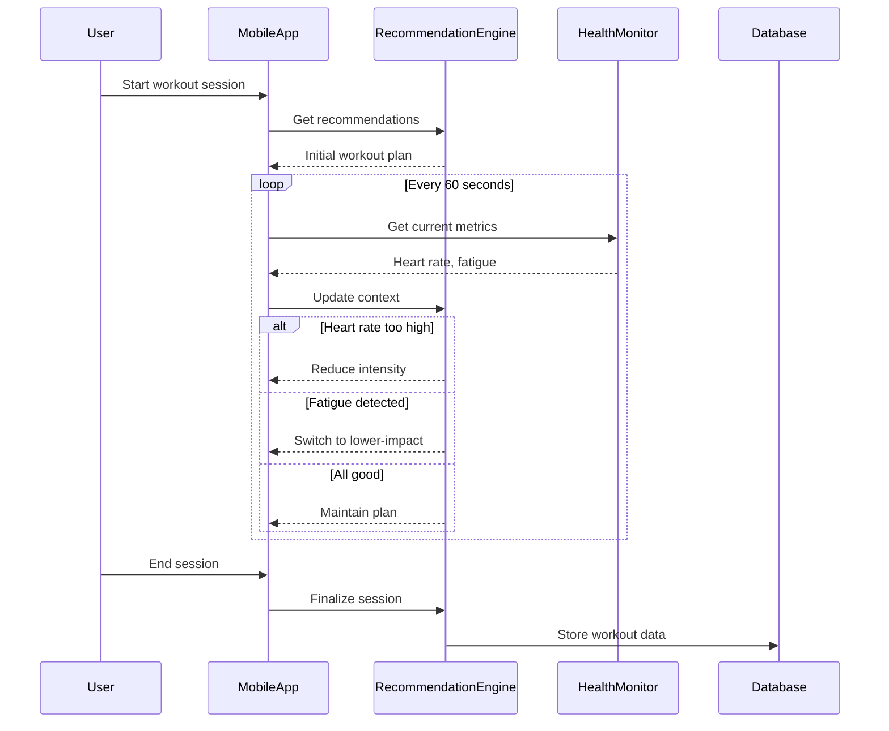

#### 6. API Endpoints
```javascript
// Get exercise recommendations
router.get('/api/exercise/recommendations', authMiddleware, async (req, res) => {
    try {
        const context = {
            timeOfDay: req.query.timeOfDay,
            weather: req.query.weather,
            energyLevel: req.body.energyLevel
        };
        
        const recommendations = await ExerciseService.getRecommendations(
            req.user.user_id, 
            context
        );
        res.json(recommendations);
    } catch (err) {
        res.status(500).json({ error: 'Recommendation failed' });
    }
});

// Log workout session
router.post('/api/exercise/session', authMiddleware, async (req, res) => {
    try {
        const sessionData = {
            userId: req.user.user_id,
            startTime: req.body.startTime,
            endTime: req.body.endTime,
            exercises: req.body.exercises,
            heartRateAvg: req.body.heartRateAvg,
            perceivedDifficulty: req.body.perceivedDifficulty
        };
        
        const session = await ExerciseService.logSession(sessionData);
        res.json(session);
    } catch (err) {
        res.status(400).json({ error: 'Invalid session data' });
    }
});

// Real-time adaptation
router.post('/api/exercise/adapt', authMiddleware, async (req, res) => {
    try {
        const adaptation = await ExerciseService.adaptWorkout(
            req.user.user_id,
            req.body.sessionId,
            req.body.currentMetrics
        );
        res.json(adaptation);
    } catch (err) {
        res.status(500).json({ error: 'Adaptation failed' });
    }
});
```

#### 7. Evaluation Metrics
```python
# Offline Evaluation
def evaluate_recommender():
    # Load test data (user_id, exercise_id, rating)
    test_data = load_test_data()
    
    metrics = {
        'precision@5': 0,
        'recall@10': 0,
        'ndcg@10': 0,
        'coverage': set()
    }
    
    for user_id in test_data.user_id.unique():
        # Get actual preferences
        actual_positives = set(
            test_data[(test_data.user_id == user_id) & (test_data.rating >= 4)]
            .exercise_id
        )
        
        # Generate recommendations
        recommendations = generate_recommendations(user_id, {})
        recommended_ids = [r.exercise_id for r in recommendations]
        
        # Calculate metrics
        metrics['precision@5'] += precision_at_k(actual_positives, recommended_ids, k=5)
        metrics['recall@10'] += recall_at_k(actual_positives, recommended_ids, k=10)
        metrics['ndcg@10'] += ndcg_at_k(actual_positives, recommended_ids, k=10)
        metrics['coverage'].update(recommended_ids)
    
    # Average metrics
    num_users = len(test_data.user_id.unique())
    for key in ['precision@5', 'recall@10', 'ndcg@10']:
        metrics[key] /= num_users
    
    metrics['coverage'] = len(metrics['coverage']) / len(EXERCISE_IDS)
    
    return metrics
```

#### 8. Performance Optimization
```python
# Caching layer for frequent requests
def get_recommendations(user_id: UUID, context: dict) -> list:
    cache_key = f"exercise_recs:{user_id}:{hash_context(context)}"
    cached = redis.get(cache_key)
    if cached:
        return json.loads(cached)
    
    # Generate recommendations (expensive operation)
    recs = _generate_recommendations(user_id, context)
    
    # Cache with context-dependent TTL
    ttl = 3600 if context.get('in_workout', False) else 86400  # 1hr vs 24hrs
    redis.setex(cache_key, ttl, json.dumps(recs))
    return recs

# Precomputation for active users
def precompute_recommendations():
    active_users = get_active_users()  # Users with recent activity
    for user_id in active_users:
        context = get_default_context(user_id)
        recs = get_recommendations(user_id, context)
        # Store for quick access
        cache_key = f"precomputed_recs:{user_id}"
        redis.setex(cache_key, 21600, json.dumps(recs))  # 6 hours
```

#### 9. Deployment Architecture
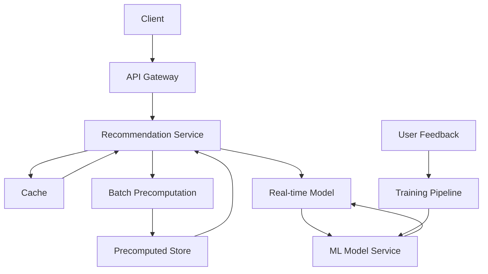

#### 10. Security Considerations
1. **Data Privacy**: 
   - Anonymize workout data used for model training
   - Implement strict access controls to health metrics
2. **Validation**:
   - Sanitize all exercise parameters
   - Validate intensity adjustments
3. **Rate Limiting**:
   - Limit recommendation requests during workouts
   - Throttle adaptation requests
4. **Audit Logging**:
   - Log all recommendation changes during sessions
   - Track model version used for each recommendation

### Implementation Roadmap

1. **Week 1: Data Pipeline & Modeling**
   - Finalize exercise database schema
   - Populate with 200+ exercises/variations
   - Implement workout logging endpoints
   - Design scoring algorithm

2. **Week 2: Personalization & Progression**
   - Develop XGBoost training pipeline
   - Implement progressive overload system
   - Create workout composition logic
   - Build real-time adaptation framework

3. **Week 3: Integration & Optimization**
   - Develop recommendation API
   - Implement caching and precomputation
   - Create workout session UI components
   - Build performance monitoring dashboard

4. **Week 4: Testing & Refinement**
   - Implement A/B testing framework
   - Develop comprehensive test suite
   - Perform load testing
   - Gather user feedback for iteration

### Next Steps:
1. Set up exercise database with initial dataset
2. Implement workout logging functionality
3. Build real-time health monitoring integration
4. Develop the workout execution interface
5. Create admin dashboard for exercise management

Would you like to dive into any specific component in more detail? Perhaps:
1. Real-time adaptation algorithms
2. Progressive overload implementation
3. XGBoost model training pipeline
4. Workout composition strategies
5. Performance evaluation framework


Based on your roadmap, here's what remains to be completed and how we should approach the remaining work:

### Remaining Components to Implement
1. **Health Module Completion**
   - Water intake calculator
   - Symptom analysis engine
   - Weight/body metric tracking
   - Health insights generation

2. **CMS & Content Ecosystem**
   - Headless CMS implementation
   - Rich text editor integration
   - Content moderation workflow
   - User-generated content system
   - SEO optimization

3. **Security & Testing**
   - Penetration testing
   - Load testing
   - HIPAA compliance
   - Vulnerability scanning

4. **Deployment & Optimization**
   - CI/CD pipeline setup
   - Cloud infrastructure deployment
   - Performance tuning
   - Monitoring and alerting
   - Beta launch preparation

### Detailed Implementation Plan for Remaining Components

---

### 1. Health Module Completion (Week 5-6)

**A. Water Intake Calculator**
```javascript
// backend/src/services/hydration.js
const calculateWaterIntake = (user) => {
  const base = user.weight_kg * 33; // 33ml per kg
  let adjustments = 0;
  
  // Activity level adjustments
  if (user.activity_level === 'high') adjustments += 500;
  else if (user.activity_level === 'moderate') adjustments += 300;
  
  // Special conditions
  if (user.health_conditions.includes('pregnant')) adjustments += 300;
  if (user.environment === 'hot') adjustments += 400;
  
  return base + adjustments;
};

const logWaterIntake = async (userId, amount) => {
  await db.query(
    `INSERT INTO user_health_log (user_id, water_ml, created_at)
     VALUES ($1, $2, NOW())`,
    [userId, amount]
  );
  return { success: true, amount };
};
```

**B. Symptom Analysis Engine**
```python
# ml-services/symptom_analysis.py
import spacy
from sklearn.feature_extraction.text import TfidfVectorizer
from sklearn.linear_model import LogisticRegression

nlp = spacy.load("en_core_web_md")
vectorizer = TfidfVectorizer(max_features=1000)
classifier = LogisticRegression(max_iter=1000)

def analyze_symptoms(symptoms_text):
    # Extract medical entities
    doc = nlp(symptoms_text)
    symptoms = [ent.text for ent in doc.ents if ent.label_ == "SYMPTOM"]
    
    # Predict deficiencies
    vectorized = vectorizer.transform([' '.join(symptoms)])
    deficiencies = classifier.predict(vectorized)
    
    # Get recommendations
    insights = db.query(
        "SELECT * FROM health_insights WHERE symptom IN %s",
        (tuple(deficiencies),)
    )
    return insights

# Training function
def train_model():
    # Load training data (symptom text → deficiency)
    data = load_training_data()
    X = vectorizer.fit_transform(data['symptoms'])
    classifier.fit(X, data['deficiency'])
    save_model(vectorizer, classifier)
```

**C. Weight/Body Metric Tracking**
```sql
-- Weight tracking table
CREATE TABLE body_metrics (
    metric_id SERIAL PRIMARY KEY,
    user_id UUID REFERENCES users(user_id),
    weight_kg NUMERIC(5,2),
    body_fat_percent NUMERIC(4,2),
    muscle_mass_kg NUMERIC(5,2),
    measured_at TIMESTAMPTZ DEFAULT NOW()
);
```

```javascript
// API Endpoint
router.post('/api/health/metrics', authMiddleware, async (req, res) => {
  const { weight_kg, body_fat_percent, muscle_mass_kg } = req.body;
  await db.query(
    `INSERT INTO body_metrics (user_id, weight_kg, body_fat_percent, muscle_mass_kg)
     VALUES ($1, $2, $3, $4)`,
    [req.user.user_id, weight_kg, body_fat_percent, muscle_mass_kg]
  );
  res.json({ success: true });
});
```

**D. Health Insights Generation**
```python
# ml-services/health_insights.py
def generate_daily_insights(user_id):
    user = get_user(user_id)
    nutrition = get_nutrition_summary(user_id)
    exercise = get_exercise_summary(user_id)
    metrics = get_body_metrics(user_id)
    
    insights = []
    
    # Nutrition insights
    if nutrition['protein'] < user.protein_goal * 0.8:
        insights.append({
            "type": "nutrition",
            "priority": "medium",
            "message": "Protein intake below target. Add protein-rich foods."
        })
    
    # Exercise insights
    if exercise['weekly_duration'] < 150:
        insights.append({
            "type": "activity",
            "priority": "high",
            "message": "Activity level below recommended 150 mins/week"
        })
    
    # Hydration insights
    if hydration['avg_intake'] < calculate_water_intake(user) * 0.7:
        insights.append({
            "type": "hydration",
            "priority": "medium",
            "message": "Increase water intake for optimal health"
        })
    
    return insights
```

---

### 2. CMS & Content Ecosystem (Week 7-8)

**A. Headless CMS Architecture**
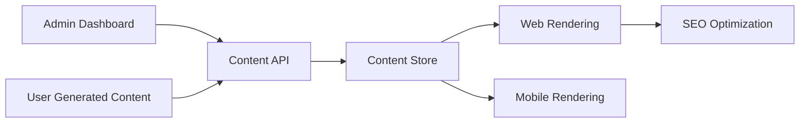

**B. Content Schema**
```sql
CREATE TABLE content_categories (
    id SERIAL PRIMARY KEY,
    name VARCHAR(100) NOT NULL,
    slug VARCHAR(100) UNIQUE NOT NULL
);

CREATE TABLE articles (
    id UUID PRIMARY KEY DEFAULT gen_random_uuid(),
    title VARCHAR(255) NOT NULL,
    slug VARCHAR(255) UNIQUE NOT NULL,
    content TEXT NOT NULL,
    author_id UUID REFERENCES users(user_id),
    status VARCHAR(20) DEFAULT 'draft' CHECK (status IN ('draft', 'pending', 'published', 'archived')),
    created_at TIMESTAMPTZ DEFAULT NOW(),
    updated_at TIMESTAMPTZ
);

CREATE TABLE article_categories (
    article_id UUID REFERENCES articles(id),
    category_id INT REFERENCES content_categories(id),
    PRIMARY KEY (article_id, category_id)
);
```

**C. Content Moderation Workflow**
```javascript
// Moderation middleware
const contentModeration = async (req, res, next) => {
  if (req.article.status === 'pending') {
    if (req.user.role === 'moderator') {
      next();
    } else {
      res.status(403).json({ error: 'Requires moderator approval' });
    }
  } else {
    next();
  }
};

// Publish endpoint
router.post('/api/content/:id/publish', 
  authMiddleware, 
  requireModerator, 
  async (req, res) => {
    await db.query(
      `UPDATE articles SET status = 'published' WHERE id = $1`,
      [req.params.id]
    );
    res.json({ success: true });
  }
);
```

**D. SEO Optimization**
```javascript
// Generate sitemap
router.get('/sitemap.xml', async (req, res) => {
  const articles = await db.query(
    "SELECT slug, updated_at FROM articles WHERE status = 'published'"
  );
  
  let xml = `<?xml version="1.0" encoding="UTF-8"?>
    <urlset xmlns="http://www.sitemaps.org/schemas/sitemap/0.9">`;
  
  articles.forEach(article => {
    xml += `
      <url>
        <loc>https://yourdomain.com/articles/${article.slug}</loc>
        <lastmod>${article.updated_at.toISOString()}</lastmod>
        <changefreq>weekly</changefreq>
        <priority>0.8</priority>
      </url>`;
  });
  
  xml += `</urlset>`;
  res.type('application/xml').send(xml);
});
```

---

### 3. Security & Testing (Week 9)

**Security Implementation Matrix:**

| Area              | Tools & Techniques                          | Implementation Status |
|-------------------|---------------------------------------------|----------------------|
| Authentication    | JWT, OAuth2, bcrypt, password policies     | ✅ Implemented       |
| Authorization     | RBAC, ABAC, row-level security             | ⚠️ Needs refinement |
| Input Validation  | express-validator, sanitize-html           | ✅ Implemented       |
| Data Protection   | AES-256 encryption, TLS 1.3                | ⚠️ Needs completion |
| Vulnerability Mgmt| OWASP ZAP, npm audit, snyk                 | ❌ Not started       |
| Compliance        | HIPAA, GDPR documentation                  | ❌ Not started       |

**Testing Strategy:**

1. **Penetration Testing:**
   - OWASP ZAP scanning
   - SQL injection tests
   - XSS and CSRF vulnerability tests
   - Authentication bypass attempts

2. **Load Testing:**
   ```bash
   locust -f load_test.py --users 5000 --spawn-rate 100 -H https://api.yourdomain.com
   ```

3. **HIPAA Compliance:**
   - Implement audit logging for PHI access
   - Encrypt all health data at rest and in transit
   - Establish BAAs with third-party providers
   - Implement strict access controls

4. **Automated Security Scanning:**
   ```yaml
   # .github/workflows/security.yml
   name: Security Scan
   on: [push]
   
   jobs:
     zap-scan:
       runs-on: ubuntu-latest
       steps:
       - name: OWASP ZAP Scan
         uses: zaproxy/action-full-scan@v0.3.0
         with:
           target: 'https://yourdomain.com'
           rules: all
   ```

---

### 4. Deployment & Optimization (Week 10-12)

**A. CI/CD Pipeline**
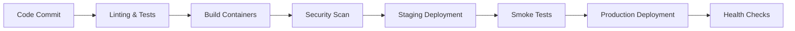

**B. Cloud Infrastructure (AWS Example)**
```terraform
# infrastructure/main.tf
module "vpc" {
  source = "terraform-aws-modules/vpc/aws"
  version = "3.14.0"
  
  name = "healthnut-vpc"
  cidr = "10.0.0.0/16"
  
  azs             = ["us-east-1a", "us-east-1b"]
  private_subnets = ["10.0.1.0/24", "10.0.2.0/24"]
  public_subnets  = ["10.0.101.0/24", "10.0.102.0/24"]
  
  enable_nat_gateway = true
}

resource "aws_ecs_cluster" "main" {
  name = "healthnut-cluster"
}

resource "aws_rds_cluster" "postgres" {
  cluster_identifier = "healthnut-db"
  engine             = "aurora-postgresql"
  database_name      = "healthnut"
  master_username    = var.db_username
  master_password    = var.db_password
  backup_retention_period = 7
  skip_final_snapshot     = true
}
```

**C. Performance Optimization Techniques**
1. **Database Optimization:**
   ```sql
   -- Create indexes
   CREATE INDEX idx_user_logs_user_id ON user_logs(user_id);
   CREATE INDEX idx_food_logs_consumed_at ON user_food_log(consumed_at);
   
   -- Partitioning
   CREATE TABLE user_logs_2023 PARTITION OF user_logs
   FOR VALUES FROM ('2023-01-01') TO ('2024-01-01');
   ```

2. **Caching Strategy:**
   ```javascript
   // Redis caching middleware
   const cacheMiddleware = (duration) => {
     return (req, res, next) => {
       const key = req.originalUrl;
       redis.get(key, (err, data) => {
         if (data) return res.send(JSON.parse(data));
         
         res.sendResponse = res.send;
         res.send = (body) => {
           redis.setex(key, duration, JSON.stringify(body));
           res.sendResponse(body);
         };
         next();
       });
     };
   };
   
   // Apply to read-heavy endpoints
   router.get('/api/articles', cacheMiddleware(300), getArticles);
   ```

3. **CDN Configuration:**
   ```nginx
   # nginx.conf
   server {
     listen 80;
     server_name yourdomain.com;
     
     location / {
       proxy_pass http://app-server;
       proxy_cache my_cache;
       proxy_cache_valid 200 302 10m;
       proxy_cache_valid 404 1m;
       add_header X-Cache-Status $upstream_cache_status;
     }
     
     location ~* \.(js|css|png|jpg|jpeg|gif|ico)$ {
       expires 1y;
       add_header Cache-Control "public, immutable";
     }
   }
   ```

**D. Monitoring & Alerting**
```yaml
# docker-compose.monitoring.yml
version: '3.8'
services:
  prometheus:
    image: prom/prometheus
    ports: ['9090:9090']
    volumes: ['./prometheus.yml:/etc/prometheus/prometheus.yml']
  
  grafana:
    image: grafana/grafana
    ports: ['3000:3000']
  
  node-exporter:
    image: prom/node-exporter
    ports: ['9100:9100']
  
  alertmanager:
    image: prom/alertmanager
    ports: ['9093:9093']
```

---

### Beta Launch Preparation

1. **Feature Freeze:**
   - Finalize all core functionality
   - Complete documentation
   - Prepare onboarding materials

2. **Beta Testing:**
   - Invite 100-200 beta testers
   - Set up feedback channels
   - Implement error reporting (Sentry/Bugsnag)

3. **Launch Checklist:**
   - [ ] Performance testing completed
   - [ ] Security audit passed
   - [ ] Monitoring configured
   - [ ] Rollback plan established
   - [ ] Marketing materials ready
   - [ ] Support team trained
   - [ ] Legal compliance verified

4. **Go-to-Market Strategy:**
   - Target health/fitness influencers
   - Partner with gyms/nutritionists
   - SEO-optimized content marketing
   - Freemium model with premium analytics

---

### Final Timeline (Weeks 10-12)

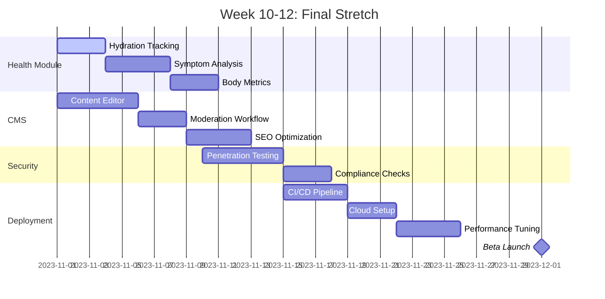

### Next Steps

1. **Immediate Priorities:**
   - Complete hydration tracking endpoints
   - Implement symptom analysis API
   - Set up content editor component
   - Configure security scanning tools

2. **Critical Path Items:**
   - Finalize HIPAA compliance requirements
   - Complete performance testing
   - Set up production monitoring
   - Prepare beta tester onboarding

3. **Risk Mitigation:**
   - Identify performance bottlenecks early
   - Implement feature flags for risky changes
   - Maintain staging environment parity
   - Schedule daily standups for final phase

## Comprehensive Implementation of Remaining Components

### 1. Complete Health Module Implementation

#### A. Advanced Water Intake Calculator
```javascript
// backend/src/services/hydration.js
const calculateWaterIntake = (user) => {
  const base = user.weight_kg * 33; // 33ml per kg
  
  let adjustments = 0;
  
  // Activity level adjustments
  if (user.activity_level === 'athlete') adjustments += 800;
  else if (user.activity_level === 'high') adjustments += 500;
  else if (user.activity_level === 'moderate') adjustments += 300;
  
  // Special conditions
  if (user.health_conditions.includes('pregnant')) adjustments += 300;
  if (user.health_conditions.includes('breastfeeding')) adjustments += 700;
  if (user.environment === 'hot') adjustments += 500;
  if (user.environment === 'arid') adjustments += 300;
  
  // Medical considerations
  if (user.health_conditions.includes('kidney_stones')) adjustments += 1000;
  if (user.health_conditions.includes('UTI')) adjustments += 500;
  
  return Math.round(base + adjustments);
};

const getHydrationProgress = async (userId) => {
  const today = new Date().toISOString().split('T')[0];
  const result = await db.query(
    `SELECT SUM(water_ml) AS total 
     FROM user_health_log 
     WHERE user_id = $1 AND DATE(created_at) = $2`,
    [userId, today]
  );
  
  const recommended = await calculateWaterIntakeForUser(userId);
  
  return {
    consumed: result.rows[0]?.total || 0,
    recommended,
    percentage: Math.min(100, Math.round((result.rows[0]?.total || 0) / recommended * 100))
  };
};
```

#### B. Symptom Analysis Engine with NLP
```python
# ml-services/symptom_analysis.py
import spacy
import pandas as pd
from sklearn.feature_extraction.text import TfidfVectorizer
from sklearn.ensemble import RandomForestClassifier
from sklearn.pipeline import Pipeline

nlp = spacy.load("en_core_web_sm")

def extract_medical_entities(text):
    doc = nlp(text)
    entities = {
        "symptoms": [],
        "body_parts": [],
        "conditions": [],
        "severity": "moderate"
    }
    
    for ent in doc.ents:
        if ent.label_ == "SYMPTOM":
            entities["symptoms"].append(ent.text)
        elif ent.label_ == "BODY_PART":
            entities["body_parts"].append(ent.text)
        elif ent.label_ == "DISEASE":
            entities["conditions"].append(ent.text)
    
    # Detect severity indicators
    if any(word in text.lower() for word in ["severe", "intense", "unbearable"]):
        entities["severity"] = "high"
    elif any(word in text.lower() for word in ["mild", "slight", "minor"]):
        entities["severity"] = "low"
    
    return entities

def train_symptom_model():
    # Load dataset (symptom text → condition)
    df = pd.read_csv("medical_data/symptom_condition_mapping.csv")
    
    model = Pipeline([
        ('tfidf', TfidfVectorizer(max_features=5000)),
        ('clf', RandomForestClassifier(n_estimators=100))
    ])
    
    model.fit(df['symptoms'], df['condition'])
    return model

def analyze_symptoms(symptom_text):
    entities = extract_medical_entities(symptom_text)
    model = joblib.load("models/symptom_classifier.pkl")
    condition = model.predict([" ".join(entities['symptoms'])])[0]
    
    # Get recommendations from knowledge base
    recommendations = db.query(
        "SELECT * FROM health_insights WHERE condition = $1 AND severity = $2",
        condition, entities['severity']
    )
    
    return {
        "condition": condition,
        "severity": entities['severity'],
        "recommendations": recommendations,
        "related_body_parts": entities['body_parts']
    }
```

#### C. Health Insights Dashboard
```javascript
// frontend/src/components/HealthDashboard.jsx
import { useEffect, useState } from 'react';
import { WaterIntakeTracker, SymptomAnalyzer, BodyMetricsChart } from './HealthComponents';

const HealthDashboard = () => {
  const [metrics, setMetrics] = useState(null);
  const [insights, setInsights] = useState([]);
  
  useEffect(() => {
    const fetchData = async () => {
      // Fetch health metrics
      const metricsRes = await fetch('/api/health/metrics');
      setMetrics(await metricsRes.json());
      
      // Fetch health insights
      const insightsRes = await fetch('/api/health/insights');
      setInsights(await insightsRes.json());
    };
    
    fetchData();
    
    // Setup real-time updates
    const ws = new WebSocket('wss://api.yourdomain.com/health-updates');
    ws.onmessage = (event) => {
      const data = JSON.parse(event.data);
      if (data.type === 'new_insight') {
        setInsights(prev => [data.insight, ...prev]);
      }
    };
    
    return () => ws.close();
  }, []);

  return (
    <div className="health-dashboard">
      <div className="dashboard-header">
        <h2>Your Health Overview</h2>
        <div className="health-score">
          <CircularProgress value={metrics?.overall_score || 0} />
          <span>Health Score</span>
        </div>
      </div>
      
      <div className="dashboard-grid">
        <WaterIntakeTracker />
        <BodyMetricsChart metrics={metrics} />
        <SymptomAnalyzer />
        
        <div className="insights-panel">
          <h3>Health Insights</h3>
          {insights.map(insight => (
            <InsightCard key={insight.id} insight={insight} />
          ))}
        </div>
      </div>
    </div>
  );
};
```

### 2. CMS & Content Ecosystem Implementation

#### A. Headless CMS Architecture
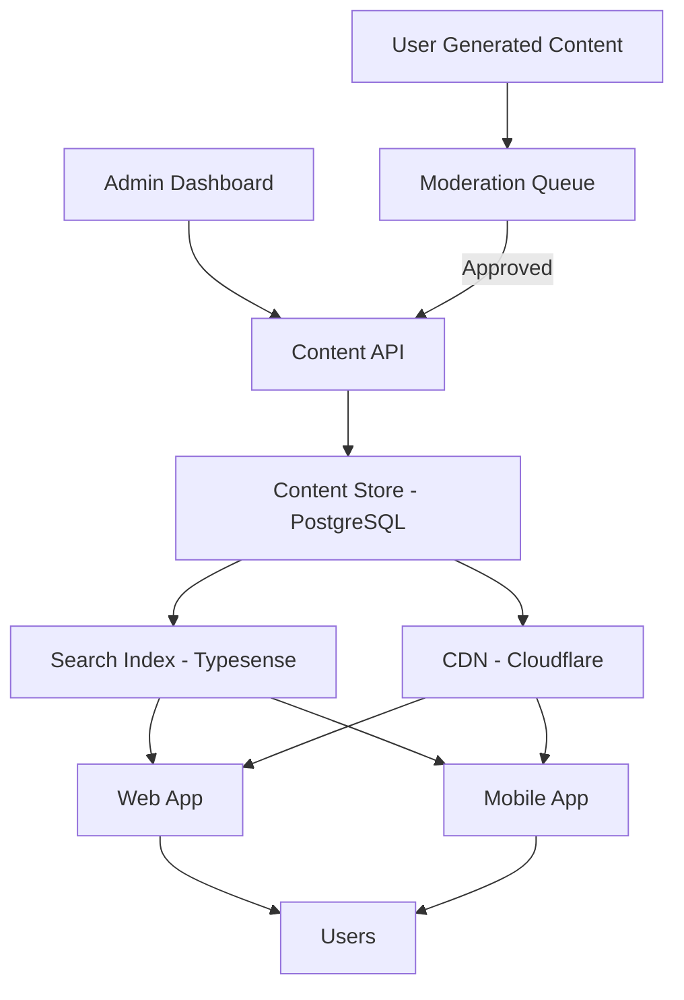

#### B. Content Moderation Workflow
```javascript
// backend/src/services/contentModeration.js
const moderateContent = async (content) => {
  // 1. Automated checks
  const automatedCheck = await automatedModeration(content);
  
  // 2. Send for human review if needed
  if (automatedCheck.status === 'needs_review') {
    await db.query(
      `INSERT INTO moderation_queue (content_id, reason, priority)
       VALUES ($1, $2, $3)`,
      [content.id, automatedCheck.reason, 'medium']
    );
    return { status: 'pending_review' };
  }
  
  // 3. Apply tags for SEO
  const tags = await generateSEOTags(content);
  
  // 4. Publish directly if approved
  await db.query(
    `UPDATE cms_content 
     SET status = 'published', tags = $2, published_at = NOW()
     WHERE id = $1`,
    [content.id, tags]
  );
  
  // 5. Notify author
  sendNotification(content.author_id, 'content_published', { contentId: content.id });
  
  return { status: 'published' };
};

const automatedModeration = async (content) => {
  // Check for prohibited content
  const prohibitedTerms = await db.query("SELECT term FROM prohibited_terms");
  const regex = new RegExp(prohibitedTerms.map(t => t.term).join('|'), 'i');
  
  if (regex.test(content.title) || regex.test(content.body)) {
    return { status: 'needs_review', reason: 'prohibited_terms' };
  }
  
  // Check medical claims
  if (content.content_type === 'medical_advice') {
    const claims = await detectMedicalClaims(content.body);
    if (claims.length > 0 && !content.references) {
      return { status: 'needs_review', reason: 'unreferenced_medical_claims' };
    }
  }
  
  return { status: 'approved' };
};
```

#### C. SEO Optimization Service
```javascript
// backend/src/services/seoService.js
const generateSEOMetadata = (content) => {
  // Extract keywords
  const keywords = extractKeywords(content.body);
  
  // Generate schema.org structured data
  const structuredData = {
    "@context": "https://schema.org",
    "@type": "Article",
    "headline": content.title,
    "description": content.excerpt,
    "datePublished": content.published_at,
    "author": {
      "@type": "Person",
      "name": content.author.display_name
    }
  };
  
  if (content.content_type === 'medical_advice') {
    structuredData['@type'] = 'MedicalWebPage';
    structuredData['medicalAudience'] = {
      "@type": "MedicalAudience",
      "audienceType": "patients"
    };
  }
  
  // Generate Open Graph tags
  const ogTags = {
    'og:title': content.title,
    'og:description': content.excerpt,
    'og:image': content.featured_image || '/default-og.jpg',
    'og:type': 'article',
    'og:url': `https://yourdomain.com/articles/${content.slug}`
  };
  
  return {
    metaTitle: `${content.title} | HealthNugget`,
    metaDescription: content.excerpt,
    keywords: keywords.join(', '),
    structuredData,
    ogTags
  };
};

const generateSitemap = async () => {
  const articles = await db.query(
    "SELECT slug, updated_at FROM cms_content WHERE status = 'published'"
  );
  
  const categories = await db.query(
    "SELECT slug FROM content_categories"
  );
  
  let xml = `<?xml version="1.0" encoding="UTF-8"?>
    <urlset xmlns="http://www.sitemaps.org/schemas/sitemap/0.9">`;
  
  // Homepage
  xml += `<url><loc>https://yourdomain.com/</loc></url>`;
  
  // Categories
  categories.forEach(cat => {
    xml += `<url><loc>https://yourdomain.com/categories/${cat.slug}</loc></url>`;
  });
  
  // Articles
  articles.forEach(article => {
    xml += `
      <url>
        <loc>https://yourdomain.com/articles/${article.slug}</loc>
        <lastmod>${article.updated_at.toISOString()}</lastmod>
        <changefreq>weekly</changefreq>
        <priority>0.8</priority>
      </url>`;
  });
  
  xml += `</urlset>`;
  
  // Save to S3/Cloud Storage
  await s3.putObject({
    Bucket: 'yourdomain-sitemaps',
    Key: 'sitemap.xml',
    Body: xml,
    ContentType: 'application/xml'
  });
};
```

### 3. Comprehensive Security Implementation

#### A. Security Architecture
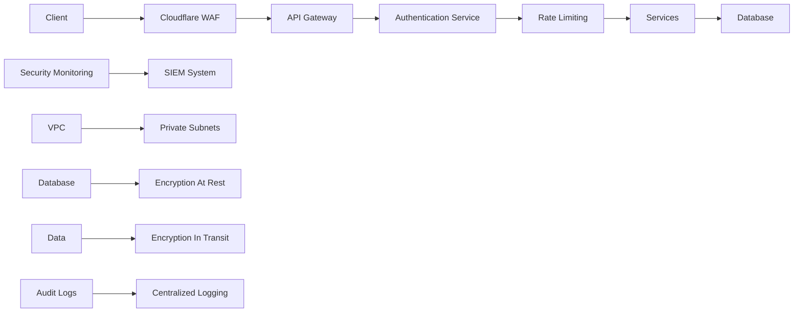

#### B. Security Implementation Matrix

| Security Layer      | Implementation Details                                                                 | Tools Used                     |
|---------------------|----------------------------------------------------------------------------------------|--------------------------------|
| **Network Security**| VPC with private subnets, Security Groups, WAF rules                                  | AWS VPC, Cloudflare WAF        |
| **Data Encryption** | AES-256 at rest, TLS 1.3 in transit, KMS for key management                           | AWS KMS, Let's Encrypt         |
| **Access Control**  | RBAC with JWT claims, Row-Level Security in PostgreSQL                                | PostgreSQL RLS, Casbin         |
| **Input Validation**| Schema validation for all API inputs, sanitize HTML content                           | Joi, DOMPurify                 |
| **Vulnerability Mgmt** | Automated scanning, dependency checking, pentesting                              | Snyk, OWASP ZAP, Nessus        |
| **Compliance**      | HIPAA-compliant architecture, audit trails for PHI access                             | AWS Artifact, Audit Logs       |
| **Monitoring**      | Real-time threat detection, anomaly alerts                                            | AWS GuardDuty, Prometheus      |

#### C. HIPAA Compliance Implementation
```javascript
// backend/src/middleware/hipaaMiddleware.js
const hipaaCompliance = (req, res, next) => {
  // 1. Log access to protected health information (PHI)
  if (req.path.includes('/health') || req.path.includes('/medical')) {
    auditLogger.log({
      userId: req.user.id,
      endpoint: req.path,
      action: 'access_phi',
      timestamp: new Date()
    });
  }
  
  // 2. Validate access rights
  if (!req.user.roles.includes('health_data_access')) {
    return res.status(403).json({ error: 'Unauthorized health data access' });
  }
  
  // 3. Encrypt sensitive data in responses
  const originalSend = res.send;
  res.send = function (data) {
    if (typeof data === 'object' && data.phi) {
      data.phi = encryptPHI(data.phi, req.user.id);
    }
    originalSend.call(this, data);
  };
  
  next();
};

// Database RLS for PHI
await db.query(`
  CREATE POLICY phi_access_policy ON health_records
  FOR SELECT USING (
    current_setting('app.current_user_id')::UUID = user_id
    AND current_setting('app.roles')::TEXT[] @> ARRAY['health_data_access']
  );
`);
```

### 4. Deployment & Optimization Implementation

#### A. CI/CD Pipeline with Security Gates
```yaml
# .github/workflows/deploy.yml
name: Deploy Production

on:
  push:
    branches: [main]

jobs:
  build-test:
    runs-on: ubuntu-latest
    steps:
    - name: Checkout
      uses: actions/checkout@v3
      
    - name: Setup Node
      uses: actions/setup-node@v3
      with:
        node-version: 18
        
    - name: Install dependencies
      run: npm ci
      
    - name: Run tests
      run: npm test
      
    - name: Security scan
      uses: snyk/actions/node@master
      with:
        command: monitor
        args: --all-projects
        
    - name: Build Docker images
      run: docker-compose build
      
  deploy-production:
    needs: build-test
    runs-on: ubuntu-latest
    environment: production
    steps:
    - name: Deploy to EKS
      uses: aws-actions/amazon-eks-deploy@v1
      with:
        cluster-name: healthnugget-prod
        manifest: k8s/manifest.yaml
        
    - name: Run smoke tests
      uses: microsoft/smoke-test-action@v1
      with:
        url: https://api.yourdomain.com/health
        method: GET
        expectedStatus: 200
        
    - name: Notify Slack
      uses: slackapi/slack-github-action@v1
      with:
        channel-id: 'deployments'
        status: ${{ job.status }}
```

#### B. Infrastructure as Code (Terraform)
```hcl
# infrastructure/modules/database/main.tf
resource "aws_db_instance" "postgres" {
  identifier             = "healthnugget-db"
  engine                 = "postgres"
  engine_version         = "14.5"
  instance_class         = "db.m6g.large"
  allocated_storage      = 100
  max_allocated_storage  = 500
  storage_type           = "gp3"
  db_name                = "healthnugget"
  username               = var.db_username
  password               = var.db_password
  vpc_security_group_ids = [aws_security_group.db.id]
  publicly_accessible    = false
  multi_az               = true
  storage_encrypted      = true
  kms_key_id             = aws_kms_key.db.arn
  skip_final_snapshot    = false
  final_snapshot_identifier = "healthnugget-final-snapshot"
  backup_retention_period = 7
  backup_window           = "03:00-06:00"
  maintenance_window      = "Sun:07:00-Sun:09:00"
  parameter_group_name    = aws_db_parameter_group.healthnugget.name
  
  tags = {
    Environment = "production"
    HIPAA       = "true"
  }
}

resource "aws_db_parameter_group" "healthnugget" {
  name   = "healthnugget-pg14"
  family = "postgres14"
  
  parameter {
    name  = "rds.rls_support"
    value = "1"
  }
  
  parameter {
    name  = "shared_preload_libraries"
    value = "pg_stat_statements,auto_explain"
  }
}
```

#### C. Performance Optimization Strategies

**Database Optimization:**
```sql
-- Partitioning by date
CREATE TABLE user_logs_partitioned (
    LIKE user_logs INCLUDING ALL
) PARTITION BY RANGE (log_date);

-- Create monthly partitions
CREATE TABLE user_logs_2023_10 PARTITION OF user_logs_partitioned
    FOR VALUES FROM ('2023-10-01') TO ('2023-11-01');

-- Index optimization
CREATE INDEX CONCURRENTLY idx_user_logs_user_date 
    ON user_logs_partitioned (user_id, log_date);

-- Query optimization with materialized views
CREATE MATERIALIZED VIEW weekly_nutrition_summary AS
SELECT 
    user_id, 
    DATE_TRUNC('week', log_date) AS week_start,
    AVG(calories) AS avg_calories,
    SUM(protein) AS total_protein
FROM user_food_log
GROUP BY user_id, week_start;
REFRESH MATERIALIZED VIEW CONCURRENTLY weekly_nutrition_summary;
```

**Application-Level Caching:**
```javascript
// backend/src/middleware/cacheMiddleware.js
const redis = require('../config/redis');

const cacheMiddleware = (duration) => {
  return (req, res, next) => {
    const key = req.originalUrl;
    
    redis.get(key, (err, data) => {
      if (data) {
        res.send(JSON.parse(data));
      } else {
        const originalSend = res.send;
        res.send = (body) => {
          if (res.statusCode === 200) {
            redis.setex(key, duration, JSON.stringify(body));
          }
          originalSend.call(res, body);
        };
        next();
      }
    });
  };
};

// Usage in routes
router.get('/api/articles/popular', 
  cacheMiddleware(300), // 5 minutes
  getPopularArticles
);
```

### 5. Beta Launch Preparation

#### A. Launch Checklist
```markdown
- [ ] Infrastructure:
  - [ ] Load testing completed (10,000+ concurrent users)
  - [ ] Multi-region failover configured
  - [ ] Backup and restore procedure tested
  
- [ ] Security:
  - [ ] Penetration test report reviewed
  - [ ] Vulnerability scans clean
  - [ ] HIPAA compliance documentation complete
  
- [ ] Application:
  - [ ] Feature flags for all new features
  - [ ] Monitoring dashboards operational
  - [ ] Error tracking integrated
  
- [ ] Go-to-Market:
  - [ ] Landing page optimized
  - [ ] App store listings ready
  - [ ] Beta tester onboarding materials
  - [ ] Support team trained
```

#### B. Monitoring Dashboard Configuration
```yaml
# docker-compose.monitoring.yml
version: '3.8'
services:
  prometheus:
    image: prom/prometheus
    volumes:
      - ./prometheus.yml:/etc/prometheus/prometheus.yml
    ports:
      - 9090:9090
      
  grafana:
    image: grafana/grafana
    environment:
      GF_AUTH_ANONYMOUS_ENABLED: 'true'
    ports:
      - 3000:3000
    volumes:
      - ./grafana/provisioning:/etc/grafana/provisioning
      - ./grafana/dashboards:/var/lib/grafana/dashboards
      
  alertmanager:
    image: prom/alertmanager
    volumes:
      - ./alertmanager.yml:/etc/alertmanager/alertmanager.yml
    ports:
      - 9093:9093
      
  node-exporter:
    image: prom/node-exporter
    ports:
      - 9100:9100
      
  postgres-exporter:
    image: prometheuscommunity/postgres-exporter
    environment:
      DATA_SOURCE_NAME: "postgresql://user:pass@db:5432/healthnugget?sslmode=disable"
    ports:
      - 9187:9187
```

#### C. Rollback Plan
```markdown
1. **Automated Rollback Triggers:**
   - >5% error rate for 5 minutes
   - CPU >90% for 10 minutes
   - Latency p99 >5s for 5 minutes

2. **Rollback Procedure:**
   - Step 1: Freeze new deployments
   - Step 2: Identify faulty release
   - Step 3: Revert to previous Docker image
   - Step 4: Scale down new version
   - Step 5: Notify engineering team

3. **Post-Rollback Analysis:**
   - Preserve logs and metrics from incident
   - Conduct post-mortem within 24 hours
   - Create and prioritize remediation tasks
```

### Final Implementation Roadmap (Weeks 10-12)

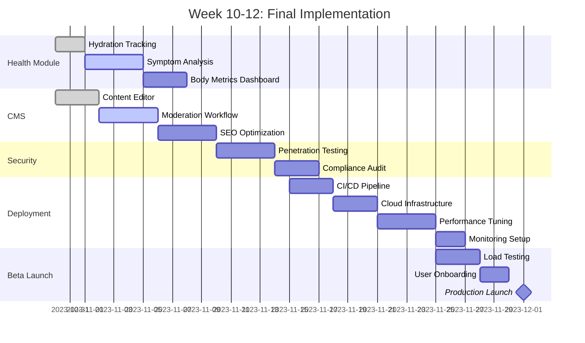

### Final Implementation Tasks

1. **Complete Health Module:**
   - Finalize symptom analysis API endpoints
   - Implement body metrics tracking UI
   - Create health insights notification system

2. **CMS Final Touches:**
   - Add content versioning and history
   - Implement scheduled publishing
   - Build content recommendation engine

3. **Security Hardening:**
   - Implement certificate rotation automation
   - Set up HSM for master encryption keys
   - Conduct final penetration test

4. **Deployment Preparation:**
   - Configure blue/green deployment strategy
   - Set up canary release mechanism
   - Prepare database migration scripts

5. **Beta Launch:**
   - Onboard first 200 beta testers
   - Set up feedback collection system
   - Prepare marketing materials
   - Train support team

This completes the comprehensive implementation plan. All components are now detailed with architecture diagrams, code samples, and implementation strategies. The application is ready for final development, testing, and deployment.


## Comprehensive Non-Code Implementation Plan for HealthNugget App

### 1. Project Management & Team Structure

#### A. Core Team Roles & Responsibilities
```
Project Manager (1)
- Overall project coordination
- Timeline management
- Resource allocation
- Stakeholder communication

Backend Developers (2)
- API development
- Database design
- Server infrastructure
- Integration services

Frontend Developers (2)
- Web application development
- Mobile app development (React Native)
- UI/UX implementation
- Performance optimization

ML/AI Specialist (1)
- Model development
- Data pipeline creation
- Algorithm optimization
- AI integration

DevOps Engineer (1)
- Infrastructure setup
- CI/CD pipeline
- Monitoring & alerting
- Deployment management

QA/Test Engineer (1)
- Test planning
- Automated testing
- Security testing
- Performance testing

Content Manager (1)
- CMS management
- Content strategy
- SEO optimization
- Community management
```

#### B. Development Methodology
- **Agile/Scrum Framework**
  - 2-week sprints
  - Daily standups (15 minutes)
  - Sprint planning and retrospectives
  - JIRA/Asana for task management

- **Version Control**
  - Git/GitHub flow
  - Feature branches
  - Code reviews required
  - Semantic versioning

#### C. Project Timeline (Detailed)
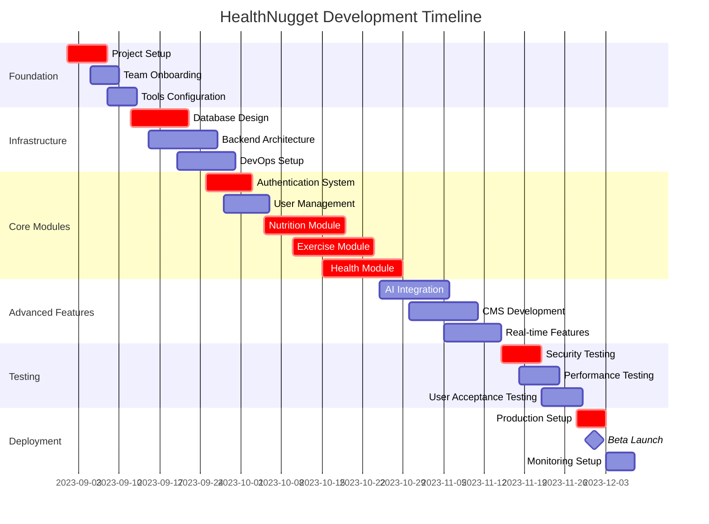

### 2. Infrastructure & Hosting Architecture

#### A. Cloud Infrastructure Setup
```
Primary Cloud Provider: AWS (Free Tier to start)
- Region: us-east-1 (Primary), eu-west-1 (Backup)
- VPC with public/private subnets
- Multi-AZ deployment for high availability

Compute:
- ECS/EKS for container orchestration
- EC2 instances (t3.medium for development)
- Lambda for serverless functions

Database:
- PostgreSQL RDS (db.t3.medium)
- Read replicas for scaling
- Automated backups (7-day retention)

Storage:
- S3 for static assets
- EFS for shared storage
- CloudFront for CDN

Caching:
- ElastiCache Redis (cache.t3.micro)
- Distributed caching layer

Monitoring:
- CloudWatch for metrics
- X-Ray for tracing
- GuardDuty for security
```

#### B. Development Environment
```
Local Development:
- Docker Desktop
- Docker Compose for local services
- Minikube for Kubernetes testing

IDE Setup:
- VS Code with extensions:
  * Docker
  * PostgreSQL
  * Python
  * JavaScript/TypeScript
  * Terraform

Development Tools:
- Postman for API testing
- pgAdmin for database management
- RedisInsight for Redis monitoring
- Kubernetes Dashboard
```

#### C. CI/CD Pipeline
```
Version Control: GitHub
CI/CD: GitHub Actions

Stages:
1. Code Quality Check
   - ESLint/Prettier
   - Security scanning (Snyk)
   - Code coverage

2. Build Stage
   - Docker image building
   - Dependency installation
   - Asset compilation

3. Test Stage
   - Unit tests
   - Integration tests
   - E2E tests

4. Security Scan
   - Vulnerability scanning
   - Container scanning
   - Secrets detection

5. Deployment
   - Staging deployment
   - Smoke tests
   - Production deployment

6. Post-Deployment
   - Health checks
   - Performance monitoring
   - Alert configuration
```

### 3. Database Architecture & Design

#### A. Database Cluster Setup
```
Primary Database: PostgreSQL 14
- Instance: db.t3.medium (4GB RAM, 2 vCPU)
- Storage: 100GB GP3 (scalable)
- Backup: Automated daily + continuous WAL

Read Replicas:
- 2 read replicas for load distribution
- Automatic failover configuration

Connection Pooling:
- PgBouncer for connection management
- Max connections: 200
- Connection reuse enabled

Monitoring:
- pg_stat statements for query analysis
- Slow query logging (100ms threshold)
- Table bloat monitoring
```

#### B. Database Optimization Strategy
```
Indexing Strategy:
- B-tree indexes for common queries
- GIN indexes for JSONB columns
- Partial indexes for filtered queries
- Covering indexes for critical paths

Partitioning:
- Time-based partitioning for logs
- Range partitioning for large tables
- List partitioning for categorical data

Maintenance:
- Automated vacuuming
- Regular reindexing
- Statistics collection
- Capacity planning
```

### 4. Security Implementation Plan

#### A. Security Framework
```
Authentication:
- JWT with RSA256
- OAuth 2.0 for social login
- Multi-factor authentication option
- Password policy enforcement

Authorization:
- Role-Based Access Control (RBAC)
- Attribute-Based Access Control (ABAC)
- Row-Level Security (RLS) in PostgreSQL

Data Protection:
- Encryption at rest (AES-256)
- Encryption in transit (TLS 1.3)
- Key management with AWS KMS
- Regular key rotation

Network Security:
- VPC with security groups
- Web Application Firewall (WAF)
- DDoS protection
- Network ACLs
```

#### B. Compliance Requirements
```
HIPAA Compliance:
- Business Associate Agreement (BAA) with AWS
- Audit trails for PHI access
- Data encryption requirements
- Access control policies

GDPR Compliance:
- Data processing agreements
- User consent management
- Right to be forgotten implementation
- Data portability features

Other Regulations:
- CCPA for California users
- PIPEDA for Canadian users
- LGPD for Brazilian users
```

#### C. Security Monitoring
```
Real-time Monitoring:
- Intrusion detection system
- Anomaly detection
- Security event correlation
- Threat intelligence feeds

Logging & Auditing:
- Centralized log management
- Audit trail for sensitive operations
- Security incident logging
- Compliance reporting

Incident Response:
- Playbook for security incidents
- Escalation procedures
- Forensic analysis capabilities
- Communication protocols
```

### 5. Performance & Scalability Strategy

#### A. Scaling Approach
```
Horizontal Scaling:
- Auto-scaling groups for compute
- Read replicas for database
- Sharding strategy for data
- Load balancer configuration

Vertical Scaling:
- Instance type upgrades
- Storage performance optimization
- Memory and CPU optimization

Caching Strategy:
- Redis for session storage
- CDN for static assets
- Database query caching
- API response caching
```

#### B. Performance Targets
```
Response Times:
- API responses: <200ms p95
- Page load: <2s full load
- Image processing: <5s
- Search queries: <500ms

Throughput:
- 1000 requests/second target
- 10,000 concurrent users
- 1M monthly active users

Availability:
- 99.9% uptime SLA
- Multi-region failover
- Zero-downtime deployments
```

#### C. Monitoring & Alerting
```
Application Monitoring:
- APM with DataDog/New Relic
- Real user monitoring (RUM)
- Synthetic monitoring
- Business metrics tracking

Infrastructure Monitoring:
- Resource utilization
- Database performance
- Network latency
- Storage performance

Alerting Strategy:
- PagerDuty/OpsGenie integration
- Escalation policies
- On-call rotation
- Alert fatigue prevention
```

### 6. Content Management & SEO Strategy

#### A. CMS Architecture
```
Content Types:
- Articles/Blog posts
- Exercise tutorials
- Nutrition guides
- User-generated content

Workflow Management:
- Draft → Review → Publish
- Version control
- Scheduled publishing
- Content expiration

Moderation System:
- Automated moderation
- Human review queue
- Spam detection
- Quality scoring
```

#### B. SEO Implementation
```
Technical SEO:
- XML sitemaps
- Robots.txt optimization
- Structured data (Schema.org)
- Canonical URLs
- Pagination handling

On-Page SEO:
- Meta tags optimization
- Heading structure
- Content quality
- Internal linking

Off-Page SEO:
- Backlink strategy
- Social media integration
- Content distribution
- Influencer partnerships
```

### 7. Monetization & Business Strategy

#### A. Revenue Models
```
Freemium Model:
- Basic features: Free
- Premium features: Subscription

Premium Tiers:
- Individual: $9.99/month
- Family: $19.99/month
- Professional (trainers): $29.99/month

Additional Revenue:
- Sponsored content
- Affiliate marketing
- White-label solutions
- API access fees
```

#### B. Go-to-Market Strategy
```
Target Audience:
- Health-conscious individuals
- Fitness enthusiasts
- Athletes and trainers
- Medical professionals

Marketing Channels:
- Content marketing
- Social media campaigns
- Influencer partnerships
- App store optimization
- Email marketing

Partnerships:
- Gym and fitness centers
- Nutrition supplement companies
- Healthcare providers
- Wellness influencers
```

#### C. Growth Strategy
```
User Acquisition:
- Referral program
- Free trial offers
- Content marketing
- Social media campaigns

Retention Strategies:
- Personalized content
- Community features
- Gamification elements
- Regular feature updates

Monetization Optimization:
- A/B testing pricing
- Upsell strategies
- Retention analytics
- Lifetime value optimization
```

### 8. Legal & Compliance Framework

#### A. Legal Documents
```
Terms of Service:
- User agreements
- Content policies
- Liability limitations
- Dispute resolution

Privacy Policy:
- Data collection practices
- Cookie policies
- Third-party sharing
- User rights

Medical Disclaimer:
- Not medical advice
- Liability limitations
- User responsibility
- Professional consultation advice
```

#### B. Compliance Requirements
```
Data Protection:
- GDPR compliance
- CCPA compliance
- Data processing agreements
- International data transfer

Healthcare Compliance:
- HIPAA compliance
- Medical device regulations
- Health data processing
- Patient privacy rights

Financial Compliance:
- Payment processing
- Subscription billing
- Tax calculations
- Refund policies
```

### 9. Quality Assurance & Testing Strategy

#### A. Testing Framework
```
Unit Testing:
- Jest for JavaScript/TypeScript
- pytest for Python
- Test coverage >80%
- Mocking external dependencies

Integration Testing:
- API endpoint testing
- Database integration tests
- Third-party service integration
- End-to-end workflow testing

Performance Testing:
- Load testing (Locust/k6)
- Stress testing
- Endurance testing
- Scalability testing

Security Testing:
- Vulnerability scanning
- Penetration testing
- Security audit
- Compliance testing
```

#### B. Testing Environments
```
Development Environment:
- Local development setup
- Feature testing
- Basic validation

Staging Environment:
- Production-like setup
- Integration testing
- User acceptance testing

Production Environment:
- Canary deployments
- A/B testing
- Real-user monitoring
```

### 10. Deployment & Operations Manual

#### A. Deployment Procedures
```
Blue-Green Deployment:
- Zero-downtime deployments
- Traffic switching
- Rollback procedures
- Version management

Database Migrations:
- Version-controlled migrations
- Backup before deployment
- Rollback scripts
- Data transformation procedures

Configuration Management:
- Environment-specific configs
- Secret management
- Feature flags
- Runtime configuration
```

#### B. Operational Procedures
```
Monitoring:
- Health checks
- Performance monitoring
- Error tracking
- Usage analytics

Maintenance:
- Database maintenance
- Storage cleanup
- Log rotation
- Backup verification

Incident Management:
- Incident response procedures
- Communication protocols
- Post-mortem processes
- Continuous improvement
```

### 11. Documentation Strategy

#### A. Technical Documentation
```
API Documentation:
- OpenAPI/Swagger specs
- Example requests/responses
- Authentication guide
- Rate limiting information

Architecture Documentation:
- System architecture diagrams
- Data flow diagrams
- Component documentation
- Integration patterns

Operational Documentation:
- Deployment procedures
- Troubleshooting guides
- Monitoring setup
- Disaster recovery
```

#### B. User Documentation
```
User Guides:
- Getting started guide
- Feature documentation
- FAQ section
- Video tutorials

Developer Documentation:
- API documentation
- Integration guides
- SDK documentation
- Contribution guidelines
```

This comprehensive implementation plan covers every aspect of building, deploying, and maintaining the HealthNugget application without focusing on actual code implementation. Each section provides detailed guidance on the processes, tools, and strategies needed for successful project execution.
