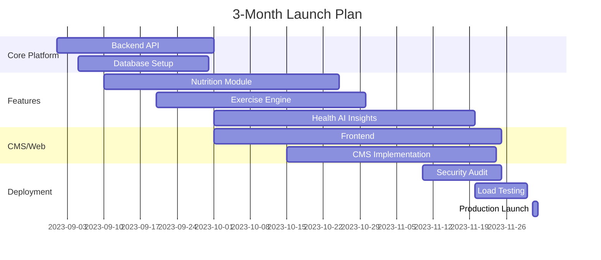

### Comprehensive Plan for Building "HealthNugget" - AI-Powered Health & Nutrition Platform

#### **Phase 1: Core Architecture & Tech Stack**
1. **Backend Framework**:
   - Node.js (Express) for API/web server
   - Python (Flask/FastAPI) for ML services
   - Communication: REST APIs + RabbitMQ for async tasks

2. **Database**:
   - PostgreSQL (Primary DB) + Redis (caching/sessions)
   - Schema Design Highlights:
     ```sql
     -- Example Core Tables --
     CREATE TABLE users (
         user_id UUID PRIMARY KEY,
         email VARCHAR(255) UNIQUE,
         password_hash TEXT,
         age INT,
         gender VARCHAR(20),
         height_cm FLOAT,
         weight_kg FLOAT,
         activity_level VARCHAR(50)
     );

     CREATE TABLE food_items (
         food_id SERIAL PRIMARY KEY,
         name VARCHAR(255) UNIQUE,
         calories FLOAT,
         protein FLOAT,
         carbs FLOAT,
         fats FLOAT,
         vitamins JSONB  -- Stores {"vitamin_a": 0.5, "vitamin_c": 20, ...}
     );

     CREATE TABLE user_logs (
         log_id BIGSERIAL PRIMARY KEY,
         user_id UUID REFERENCES users(user_id),
         log_date TIMESTAMP DEFAULT NOW(),
         food_items JSONB,  -- {food_id: qty}
         exercise_minutes INT,
         water_ml INT,
         weight FLOAT
     );

     CREATE TABLE exercises (
         exercise_id SERIAL PRIMARY KEY,
         name VARCHAR(255),
         category VARCHAR(50),  -- yoga/gym/cardio
         calories_per_min FLOAT,
         benefits TEXT[]  -- Array of benefits
     );

     CREATE TABLE health_insights (
         insight_id SERIAL PRIMARY KEY,
         symptom VARCHAR(255),  -- e.g. "blurred vision"
         potential_causes TEXT[],  -- ["vitamin_a deficiency", ...]
         recommended_actions TEXT[]
     );

     CREATE TABLE cms_content (
         content_id UUID PRIMARY KEY,
         author_id UUID REFERENCES users(user_id)),
         title VARCHAR(255),
         body TEXT,
         content_type VARCHAR(50),  -- blog/medicinal-info/user-article
         created_at TIMESTAMP DEFAULT NOW()
     );
     ```

3. **Infrastructure**:
   - Cloud: AWS/GCP (Free Tier to start)
   - Containerization: Docker + Kubernetes (EKS/GKE)
   - CI/CD: GitHub Actions + ArgoCD
   - Monitoring: Prometheus + Grafana (free)

#### **Phase 2: Core Features Implementation**
1. **Nutrition Module**:
   - Food Database: Integrate with USDA FoodData Central API (free)
   - Image Recognition: Use TensorFlow.js for food detection
   - Calorie Tracker: 
     ```python
     # Python ML Service
     def calculate_daily_needs(user_data):
         # Harris-Benedict Equation with ML adjustments
         bmr = 10*user_data['weight'] + 6.25*user_data['height'] - 5*user_data['age']
         bmr += 5 if user_data['gender'] == 'male' else -161
         return bmr * activity_factors[user_data['activity_level'] * health_factors
     ```

2. **Exercise Engine**:
   - Exercise Recommendation Algorithm:
     ```javascript
     // Node.js Recommendation Logic
     function recommendExercises(user, goals) {
       const baseExercises = await db.query(`
         SELECT * FROM exercises 
         WHERE difficulty <= $1 
         AND equipment IN ($2)
       `, [user.fitness_level, user.equipment]);
       
       // AI Personalization (Python service via RabbitMQ)
       return personalizeExercises(baseExercises, user.health_data);
     }
     ```

3. **Health Insights AI**:
   - Symptom Analysis Engine:
     ```python
     # Scikit-Learn/NLP based analyzer
     def analyze_symptoms(symptoms_text):
         vectorized = tfidf_vectorizer.transform([symptoms_text])
         deficiencies = deficiency_clf.predict(vectorized)
         return db.query("""
             SELECT * FROM health_insights 
             WHERE symptom IN %(deficiencies)s
         """, {'deficiencies': tuple(deficiencies)})
     ```

4. **Hydration Calculator**:
   - Dynamic Water Recommendation:
     ```javascript
     // Node.js
     function calculateWater(user) {
         const base = user.weight * 0.033; // liters
         let adjustment = 0;
         if (user.activity_level === 'high') adjustment += 0.5;
         if (user.health_data?.pregnant) adjustment += 0.3;
         return (base + adjustment) * 1000; // in ml
     }
     ```

#### **Phase 3: CMS & Content Ecosystem**
1. **Headless CMS Architecture**:
   - Next.js for SSG (Static Site Generation)
   - Editor: Quill.js (open-source rich text editor)
   - Moderation Flow:
     ```mermaid
     graph LR
     User[User Submits] --> ModQueue[Moderation Queue]
     ModQueue -- Approved --> Published
     ModQueue -- Rejected --> Notify[User Notification]
     ```

2. **Knowledge Base Structure**:
   - Articles tagged with:
     - Nutrition Facts
     - Exercise Science
     - Disease Prevention
     - Supplement Guides
   - SEO-optimized with automatic schema.org markup

#### **Phase 4: Security & Compliance**
1. **Critical Measures**:
   - Auth: JWT + OAuth 2.0 (Passport.js)
   - Data: AES-256 encryption at rest
   - Compliance: HIPAA-ready architecture (separate health data storage)
   - Pentesting: OWASP ZAP + SQLMap scans

2. **Security Architecture**:
   ```
   Client → Cloudflare (WAF) → API Gateway → 
   Microservice (Auth Check) → 
   [Services: User | Nutrition | CMS | ML]
   ```

#### **Phase 5: Scalability to 1M Users**
1. **Database Scaling**:
   - PostgreSQL: Read replicas + Connection pooling (PgBouncer)
   - Partitioning: 
     ```sql
     CREATE TABLE user_logs_2023 PARTITION OF user_logs
     FOR VALUES FROM ('2023-01-01') TO ('2024-01-01');
     ```

2. **Caching Strategy**:
   - Redis: 
     - Query caching (30s TTL)
     - Session storage
   - CDN: Cloudflare for static assets

3. **ML Model Serving**:
   - TensorFlow Serving with Kubernetes HPA
   - Async processing for heavy computations

#### **Phase 6: Development Roadmap**


#### **Phase 7: Monetization & Marketing Prep**
1. **Revenue Streams**:
   - Premium analytics (Athlete Mode)
   - Partner supplement marketplace
   - Health coach subscription tiers

2. **GTM Strategy**:
   - SEO: "Nutrition calculator", "Fitness tracker" keywords
   - Content Marketing: Partner with fitness influencers
   - Athlete Outreach: NCAA teams/local gym partnerships

#### **Immediate Next Steps**
1. **Set up repo structure**:
   ```
   /healthnugget
     ├── /backend-node
     ├── /ml-python
     ├── /frontend-next
     ├── /infra
     └── docker-compose.yml
   ```

2. **Initial DB migration**:
   ```bash
   npm install -g db-migrate
   db-migrate create init-tables --sql-file
   ```

3. **Core API skeleton**:
   ```javascript
   // Express.js
   app.post('/api/log-food', authMiddleware, async (req, res) => {
     const log = await FoodService.logEntry(
       req.user.id, 
       req.body.foodItems
     );
     res.json({ log, calories: log.totalCalories });
   });
   ```

#### **Key Open-Source Tools**
- ML: Scikit-learn, TensorFlow.js, spaCy
- Analytics: Apache Superset
- Search: Typesense (OSS alternative to Algolia)
- Notifications: Novu (OSS SendGrid alternative)

